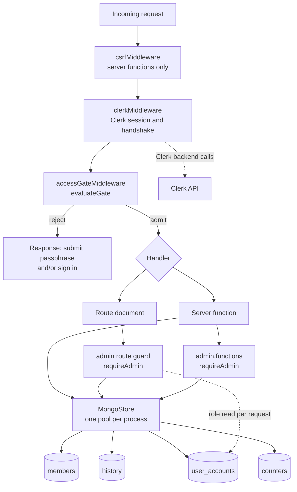

# Design Document

## Overview

This feature moves persistence from the single JSON document to MongoDB, gives the Redemption_App individual identity, and adds an `/admin` page that only the owner can reach. The Shared_Passphrase perimeter stays where it is; identity is layered on top of it, not in place of it.

The operator's decision that shapes everything below: **identity is delivered by [Clerk](https://clerk.com/docs/tanstack-react-start/getting-started/quickstart), through the `@clerk/tanstack-react-start` SDK, with Google configured as a social connection in the Clerk dashboard.** There is no hand-rolled OAuth 2.0 client in this codebase. Clerk owns the authorization-code exchange with Google, the anti-forgery state, the session token, the session cookie and its attributes, session expiry, and sign-out. What the Redemption_Server owns is everything downstream of "who is this person": mirroring the Clerk user into a User_Account document in MongoDB, deriving the Account_Role from `ADMIN_EMAILS`, enforcing that role on `/admin` and on every endpoint that serves an Admin_Page value, and combining the resulting identity with the passphrase gate.

That decision materially rewrites Requirement 5 and touches Requirement 7. The rewrite is set out in [Divergences from requirements.md](#divergences-from-requirementsmd) rather than smuggled into the prose, so the requirements document can be reconciled afterwards. Everything else in the requirements stands as written: the official `mongodb` driver, the Member_Registry and Redemption_History collections, the one-time Data_Import from `DATA_FILE`, the 5-second operation bound, index creation, secret redaction, the 100-entry and 200-record retention rules, the round-trip mapping properties, and the Admin_Page content.

Three pieces of the existing implementation change shape rather than gaining a sibling:

- `src/server/store/jsonStore.server.ts` stops being the live store. It survives as the **reader** for the Data_Import, because its `parseStoreDocument` is the tested definition of "the expected shape" that Requirement 4.1 refers to. Its flush path becomes dead code and is not wired to anything.
- `MemberRegistryStore` and `HistoryStore` keep their names and their callers, but every method becomes asynchronous and every read gains a failure case. A network store cannot answer a read synchronously, and Requirements 2.14 and 3.10 require a read to be able to fail with a message.
- The `persisted: boolean` flag and `PERSISTENCE_WARNING` disappear. Requirement 2.8 supersedes the old in-memory-with-warning behaviour: a write either landed or it did not happen, and a write that did not happen is a rejection, not a success with a warning.

### Research notes informing this design

- **Clerk on TanStack Start.** The SDK is wired in three places: `clerkMiddleware()` from `@clerk/tanstack-react-start/server` in the `requestMiddleware` array of `src/start.ts`, `<ClerkProvider>` around the document body in `src/routes/__root.tsx`, and `auth()` / `clerkClient()` from `@clerk/tanstack-react-start/server` inside server code. `auth()` returns the request's `userId`, `sessionId`, and session claims; `clerkClient().users.getUser(userId)` returns the full Backend User object, which is where the Google-asserted email address and display name live. Keys are `VITE_CLERK_PUBLISHABLE_KEY` and `CLERK_SECRET_KEY`. Google's client id and secret are configured in the Clerk dashboard, not in this app's environment. ([TanStack React Start Quickstart](https://clerk.com/docs/tanstack-react-start/getting-started/quickstart), [`clerkMiddleware()`](https://clerk.com/docs/reference/tanstack-react-start/clerk-middleware), [`auth()`](https://clerk.com/docs/reference/tanstack-react-start/auth), [reading user data](https://clerk.com/docs/tanstack-react-start/guides/users/reading))
- **The 5-second bound is a driver option, not a `Promise.race`.** The Node driver's client-side operation timeout, `timeoutMS`, covers server selection, connection checkout, and server-side execution for one operation, which is exactly the scope Requirement 1.5 describes. ([Limit Server Execution Time](https://www.mongodb.com/docs/drivers/node/v6.6/connect/connection-options/csot/)) Content was rephrased for compliance with licensing restrictions. Requirement 1.5 also forbids a second attempt at a timed-out operation, so `retryWrites` and `retryReads` are both switched off — the driver's automatic retry would otherwise be exactly the further attempt the requirement rules out.
- **Driver error messages carry the host.** A server-selection failure names the topology it could not reach. Requirements 1.5, 1.6, and 3.7 forbid that reaching a response, a log line, or the Web_Client, so no driver message is ever propagated: failures are mapped to fixed sentences declared as module constants.
- **`fast-check` is already a devDependency** and `tests/unit/propertyCoverage.test.ts` already audits the property suite for one tagged file per property at `numRuns >= 100`. The properties below extend that inventory rather than starting a second convention.

## Divergences from requirements.md

Requirements.md describes a hand-rolled Sign_In_Flow. Clerk supplies that flow. The table below states, criterion by criterion, what changes. **This design does not edit requirements.md**; these are the reconciliation notes for the next requirements pass.

### Requirement 5: satisfied by Clerk rather than by our code

| Criterion | Status under Clerk |
| --- | --- |
| 5.1 | **Restated.** `GOOGLE_CLIENT_ID` and `GOOGLE_CLIENT_SECRET` are not read from our environment; they are configured in the Clerk dashboard's Google social connection. `APP_BASE_URL` is not read either — Clerk derives its own redirect URLs from the publishable key's instance and the request origin. What the Redemption_Server reads at startup instead is `VITE_CLERK_PUBLISHABLE_KEY` and `CLERK_SECRET_KEY`, both trimmed. |
| 5.2 | **Restated.** The absent-configuration branch triggers on a missing or blank `VITE_CLERK_PUBLISHABLE_KEY` or `CLERK_SECRET_KEY`, not on the three Google/base-URL variables. The behaviour is unchanged: complete startup, log exactly one warning naming each missing variable, withhold the sign-in control, and answer an attempt to sign in with a message that names no key value. |
| 5.3 | **Obsolete.** Clerk issues and validates the anti-forgery state. The Sign_In_State concept, its 16-to-128-character shape, its 10-minute expiry, its single-use consumption, and the per-browser cap of 10 leave this codebase entirely. Nothing in our code records a Sign_In_State. |
| 5.4 | **Partly obsolete, partly restated.** The state check, the code exchange, and the session grant are Clerk's. What we still own is the User_Account write: keyed on the **Clerk user id** (which takes the Google_Subject's place as the stable identifier), holding the Google-asserted email address, the display name truncated to 100 characters or the email address when Clerk holds no name, the Account_Role from Requirement 6, and a most-recent-sign-in timestamp. The post-sign-in destination (Admin_Page for an admin, redemption page for a member) stays ours and is a Clerk redirect-URL configuration plus a route-level decision. |
| 5.5 | **Stands, with a different trigger.** Overwrite-not-duplicate still holds, keyed on the Clerk user id. The trigger changes from "a Sign_In_Flow completes" to "a request arrives bearing a Clerk session we have not yet mirrored, or whose mirror has gone stale" — see [User_Account synchronisation](#user_account-synchronisation-on-demand-upsert). |
| 5.6 | **Obsolete.** Every listed failure mode is a Clerk-side failure; Clerk renders the failure and grants no session. Our code creates no User_Account because no authenticated request ever reaches it. |
| 5.7 | **Obsolete.** No User_Session records are stored in MongoDB. Clerk holds sessions and their expiry. The `User_Sessions` collection named in the glossary is not created. |
| 5.8 | **Obsolete.** Clerk sets the session cookie and chooses its attributes. |
| 5.9 | **Restated.** Sign-out is Clerk's `<SignOutButton>` / `signOut()`; it ends the Clerk session and clears the Clerk cookie. Our part is Requirement 7.7: a sign-out must not disturb a Passphrase_Session. There is no Mongo record to delete. |
| 5.10 | **Stands, retargeted.** `CLERK_SECRET_KEY` replaces the Identity_Provider client secret as the value excluded from every response body, log entry, and value delivered to the Web_Client. `VITE_CLERK_PUBLISHABLE_KEY` is deliberately **not** secret: the `VITE_` prefix publishes it to the browser bundle, which is what a publishable key is for. |
| 5.11 | **Stands.** The email address and a sign-out control are displayed on every page rendered for a request carrying a valid Clerk session. Clerk's `<UserButton>` supplies both. |
| 5.12 | **Restated.** The Environment_Template documents `VITE_CLERK_PUBLISHABLE_KEY` and `CLERK_SECRET_KEY` — purpose, expected form, consequence of leaving unset — plus a note that the Google client id and secret live in the Clerk dashboard. |
| 5.13 | **Restated as non-fatal.** No User_Session is recorded, so a Mongo failure can no longer prevent a sign-in. A failure to write the User_Account mirror instead fails the *authorization* decision: the person is signed in as far as Clerk is concerned, and every request for an Admin_Page value answers with the Requirement 6.15 "authorization could not be determined" message. |
| 5.14 | **Obsolete.** The code exchange is Clerk's, and so is its timeout. The equivalent bound we own is the 5-second cap on the Clerk Backend API call that reads the user's email and name. |
| 5.15 | **Restated.** A Clerk user with no verified email address cannot yield a usable User_Account, so the Account_Role cannot be derived. That request is treated exactly as Requirement 6.15 describes: no Admin_Page value, and a message stating the authorization could not be determined. |

### Requirement 6 and Requirement 7

Both stand as written, with three substitutions of vocabulary and one addition:

- "valid User_Session" reads as "valid Clerk session", established by `clerkMiddleware()` and read with `auth()`.
- "Google_Subject" reads as "Clerk user id" wherever it is used as the User_Account key. Requirement 8.4's exclusion applies to it: the Clerk user id never reaches the Admin_Page response.
- Requirement 6.8's "read the Account_Role from the Mongo_Database record during that request" stands exactly, and is the reason the Account_Role is never cached in process memory or read from a Clerk session claim.
- **Addition to Requirement 7.3's exemption list.** Clerk completes a cross-domain handshake by redirecting back to an arbitrary path with `__clerk_handshake` (or `__clerk_db_jwt`) in the query string. A request carrying either parameter is exempt, because `clerkMiddleware()` consumes it and sets the session cookie on the way out; a gate rejection at that moment would drop the cookie and loop the browser. This is one exemption keyed on a query parameter rather than a path, and it admits no Member_Registry or Redemption_History value: Requirement 7.4 covers it.

### Additions beyond requirements.md

- A `counters` collection. Requirement 3.2 requires the append counter to exceed every value ever assigned — including values on records the retention rule already deleted and on records a Data_Import inserted. That cannot be derived from the surviving documents, so it needs its own durable counter. The same mechanism assigns Member_Registry position values.
- A `user_accounts` collection with a unique index on the Clerk user id. Requirement 1.7 names only two indexes; this third one is what makes Requirement 5.5's "no second User_Account for that identity" an invariant of the database rather than of the code path.

## Architecture

### Request path



The middleware order is load-bearing three times over. `csrfMiddleware` stays first because it is the cheapest check and a cross-site caller has no business learning anything else. `clerkMiddleware()` must precede the gate, because the gate asks `auth()` who the sender is and because the Clerk handshake has to be consumed before any short-circuit could discard its `Set-Cookie`. The gate stays last of the three, so a request without a Session still never reaches the router, a server function, or a store module — the guarantee `src/start.ts` already documents.

### Module layout

New modules, all server-only unless noted:

| Path | Owns |
| --- | --- |
| `src/server/store/mongo.server.ts` | The one `MongoClient` per process, the database handle, index creation, the bootstrap promise every operation awaits, and the connection indicator. |
| `src/server/store/documents.server.ts` | The Store_Document shapes and the four mapping functions between domain values and documents. No I/O. |
| `src/server/store/memberRegistry.server.ts` | *Rewritten.* Member_Registry semantics over the `members` collection, behind the existing `MemberRegistryStore` name. |
| `src/server/store/history.server.ts` | *Rewritten.* Redemption_History semantics over the `history` collection, behind the existing `HistoryStore` name. |
| `src/server/store/userAccounts.server.ts` | The `user_accounts` collection: upsert-from-Clerk, read-role-by-id, list-for-admin-page. |
| `src/server/store/counters.server.ts` | The atomic `$inc` counter behind `seq` and `position`. |
| `src/server/store/dataImport.server.ts` | The one-time Data_Import, including its 30-second bound and its rollback. |
| `src/server/identity.server.ts` | The Clerk boundary: resolve the request's identity, fetch email and display name through the Backend API, decide when a mirror refresh is due. |
| `src/server/authorization.server.ts` | `requireAdmin` and the Account_Role decision, over the injected identity and the User_Account store. |
| `src/domain/storeMessages.ts` | Client-safe: every failure sentence the store surfaces. Mirrors the existing `src/domain/rosterMessages.ts`. |
| `src/domain/accounts.ts` | Client-safe: `AccountRole`, the allowlist parser, the role derivation, and the Admin_Page view types. |
| `src/functions/admin.functions.ts` | The Admin_Page read surface, guarded independently of the route. |
| `src/routes/admin.tsx` | The `/admin` document. |
| `src/routes/sign-in.tsx` | Clerk's `<SignIn />` host, and the destination of a gate rejection that needs identity. |

Modules that change: `src/server/config.server.ts` (new variables, the Admin_Allowlist, the Clerk key accessors), `src/server/gate.server.ts` (the two-gate decision), `src/start.ts` (the middleware chain), `src/routes/__root.tsx` (`<ClerkProvider>`, the identity chrome, the conditional admin link), `src/domain/types.ts` (new `AppErrorCode` members, the store result types), and `.env.example`.

### Three seams, deliberately separate

1. **Persistence** — `MongoStore` and the two store modules. Knows nothing about identity.
2. **Identity** — `identity.server.ts`. Knows Clerk and nothing about MongoDB, other than that somebody else will mirror what it returns.
3. **Authorization** — `authorization.server.ts`. Knows the Account_Role rule, and takes both of the above as injected seams.

Keeping them apart is what lets the whole authorization decision be exercised in the node test project with a stub identity and an in-memory User_Account store, exactly as `evaluateGate` is exercised today with a two-function `Auth` literal.

## Components and Interfaces

### Configuration (`src/server/config.server.ts`)

The existing module already reads the environment exactly once per process, keeps secrets behind function accessors, and projects a deliberately narrow `ClientConfig` to the browser. All three conventions are kept.

```ts
export interface ServerConfig {
  readonly mockMode: boolean
  readonly upstreamBaseUrl: string
  /** Retained: the Data_Import source, not the live store. */
  readonly dataFile: string
  readonly passphraseRequired: boolean
  /** Trimmed `MONGODB_URI`, or null when absent/blank (Requirement 1.1). */
  readonly mongoConfigured: boolean
  /** Resolved database name (Requirement 1.2). Null when no URI is configured. */
  readonly mongoDatabaseName: string | null
  /** False when `MONGODB_URI` held characters but did not parse (Requirement 1.10). */
  readonly mongoUriParsed: boolean
  /** True when both Clerk keys are present (Requirement 5.2 restated). */
  readonly clerkConfigured: boolean
  /** The Admin_Allowlist after Requirement 6.1 normalization. Possibly empty. */
  readonly adminAllowlist: readonly string[]
}

export interface ServerSecrets {
  readSharedPassphrase: () => string | null
  readSessionSecret: () => string
  /** SERVER ONLY. Requirement 1.6: never returned, never logged. */
  readMongoUri: () => string | null
  /** SERVER ONLY. Requirement 5.10 restated. */
  readClerkSecretKey: () => string | null
}
```

`ClientConfig` gains nothing. The Admin_Page needs the Mock_Mode state and it already has it; it needs no other configuration value, and `mongoConfigured` is deliberately absent from the client projection — the Admin_Page connection indicator is served through the guarded admin server function, not through the public config read, because it is an Admin_Page value.

Two pure functions carry the parsing rules and are exported for direct testing:

```ts
/** Requirement 1.2. Returns the trimmed path segment, else MONGODB_DB_NAME, else `sw-code`. */
export function resolveDatabaseName(uri: string, envDbName: string | undefined): string

/** Requirement 6.1, in `src/domain/accounts.ts` so the client may not need it but tests may. */
export function parseAdminAllowlist(raw: string | undefined): readonly string[]
```

`parseAdminAllowlist` applies the six steps of Requirement 6.1 in order: split on `,`, trim each element, lower-case each element, drop elements of zero or more than 254 characters, drop elements holding no `@`, de-duplicate keeping first occurrence, take the first 50 survivors. It is total — every input yields an array, possibly empty (Requirement 6.2).

The Clerk publishable key is **not** in `ServerSecrets` and is not read here at all. `VITE_CLERK_PUBLISHABLE_KEY` is consumed by the Clerk SDK on both sides through Vite's `import.meta.env`, which is the documented mechanism and the reason for the prefix. `clerkConfigured` is derived from its presence so the sign-in control can be withheld, and that boolean is the only thing about it that this module holds.

Startup warnings, each logged at most once (Requirements 1.3, 1.10, 5.2 restated, 6.9):

| Condition | Warning names | Consequence |
| --- | --- | --- |
| `MONGODB_URI` absent/blank | `MONGODB_URI` | Startup completes, no pool, every store operation answers with `notConfiguredMessage()`. |
| `MONGODB_URI` present but unparsable | `MONGODB_URI`, never its value | Same as above. |
| No connection inside 10s of startup | nothing about the URI | Startup completes, operations answer `unreachableMessage()` until the driver connects. |
| Clerk keys missing | each missing variable | Startup completes, sign-in control withheld. |
| Admin_Allowlist empty | `ADMIN_EMAILS` | Startup completes, every stored User_Account gets the Member_Role. |

### The Mongo_Store (`src/server/store/mongo.server.ts`)

```ts
export interface MongoStore {
  /** Resolves when the pool is open, indexes attempted, and any Data_Import finished. */
  readonly ready: () => Promise<void>
  /** The collection handle, or a failure describing why there is none. */
  readonly collection: <T extends Document>(name: CollectionName) => Promise<CollectionOrFailure<T>>
  /** Requirement 8.3: true only while a pool is open. */
  readonly connected: () => boolean
  /** Test seam: closes the pool. */
  readonly close: () => Promise<void>
}

export type CollectionOrFailure<T> =
  | { readonly kind: "collection"; readonly collection: Collection<T> }
  | { readonly kind: "failure"; readonly failure: StoreFailure }
```

Construction, once per process:

```ts
new MongoClient(uri, {
  timeoutMS: 5_000,            // Requirement 1.5: one bound per operation
  serverSelectionTimeoutMS: 5_000,
  retryWrites: false,          // Requirement 1.5: no further attempt
  retryReads: false,
  maxPoolSize: 10,
})
```

`timeoutMS` is the whole of Requirement 1.5: it spans server selection, connection checkout, and server-side execution, and the driver raises a timeout error at the end of it without retrying. Nothing in this design layers a `Promise.race` on top of a driver call — a second timer would only make the two bounds able to disagree. The one place a `Promise.race` *is* used is around the Clerk Backend API call and around the Data_Import, because neither is a driver operation.

Bootstrap, in order, as a single promise every operation awaits (Requirement 4.1's "before it answers its first read or write"):

1. Read the URI. Absent or blank ⇒ warn once, resolve `ready`, and every `collection()` call returns a `not-configured` failure (Requirements 1.3, 1.9).
2. Construct the client. A constructor throw is the unparsable case ⇒ warn once naming the variable and no part of the value, resolve `ready`, every `collection()` returns `not-configured` (Requirement 1.10).
3. `client.connect()` raced against 10 seconds. A loss warns once and does **not** abort: the driver keeps trying in the background, so an operation arriving later succeeds while operations arriving sooner get `unreachable` (Requirement 1.11).
4. Create the indexes of Requirement 1.7 plus the User_Account uniqueness index. Each `createIndex` is awaited independently; a rejection logs one warning naming the collection and the field and does not stop the others or the bootstrap (Requirement 1.8).
5. Run the Data_Import if it is due (Requirement 4).

One client, one pool, reused for the process lifetime (Requirement 1.4). `getMongoStore()` follows the module's existing singleton-with-setter shape (`setJsonStore` / `resetJsonStore` have direct equivalents) so tests can install a store over a throwaway database.

### Store failures and their messages

```ts
// src/domain/types.ts — client-safe
export type StoreFailureReason = "not-configured" | "unreachable" | "rejected"

export interface StoreFailure {
  readonly reason: StoreFailureReason
  /** A fixed sentence from src/domain/storeMessages.ts. Never a driver message. */
  readonly message: string
}
```

`src/domain/storeMessages.ts` declares every sentence, in the same shape `rosterMessages.ts` already uses, so the store, the server functions, the pages, and the tests all assert one string:

| Function | Sentence names | Requirement |
| --- | --- | --- |
| `notConfiguredMessage()` | `MONGODB_URI` | 1.3, 1.10 |
| `unreachableMessage()` | nothing about the URI | 1.5, 1.11 |
| `rosterReadFailedMessage()` | "the roster could not be read" | 2.14 |
| `rosterWriteFailedMessage(change)` | the attempted change, e.g. `add "Ana"` | 2.8 |
| `historyReadFailedMessage()` | "the Redemption_History could not be read" | 3.10 |
| `historyAppendFailedMessage()` | "the Redemption_History record was not saved" | 3.7 |
| `authorizationUnknownMessage()` | "the authorization of the request could not be determined" | 6.15 |
| `notAuthorizedMessage()` | "the signed-in account is not authorized" | 6.6, 6.7 |
| `mongoUnavailableCountMessage()` | "the Mongo_Database is unreachable" | 8.5 |

Nothing in this table interpolates a driver error, a host name, or a URI fragment. `rosterWriteFailedMessage` interpolates a Member_Label and an operation name, both of which the caller supplied.

`AppErrorCode` gains `STORE_UNAVAILABLE`, `STORE_READ_FAILED`, `STORE_WRITE_FAILED`, `NOT_AUTHENTICATED`, `NOT_AUTHORIZED`, and `AUTHORIZATION_UNKNOWN`. The `Envelope<T>` shape is unchanged, so every existing caller keeps working.

### Member_Registry over MongoDB

The seam keeps its name; the signatures change:

```ts
export interface MemberRegistryStore {
  /** Requirement 2.2: position order. */
  list: () => Promise<ListMembersResult>
  listEnabled: () => Promise<ListMembersResult>
  /** Requirements 2.1, 2.4, 2.5, 2.8, 2.12. */
  add: (input: AddMemberFields) => Promise<AddMemberResult>
  /** Requirements 2.7, 2.13. */
  setEnabled: (id: string, enabled: boolean) => Promise<SetEnabledResult>
  /** Requirements 2.6, 2.13. */
  remove: (id: string) => Promise<RemoveMemberResult>
}

export type ListMembersResult =
  | { readonly kind: "entries"; readonly entries: readonly MemberRegistryEntry[] }
  | { readonly kind: "failed"; readonly failure: StoreFailure }

export type AddMemberResult =
  | { readonly kind: "added"; readonly entry: MemberRegistryEntry }
  | { readonly kind: "duplicate"; readonly conflictingLabel: string }
  | { readonly kind: "full" }
  | { readonly kind: "invalid"; readonly field: MemberField; readonly message: string }
  /** New: Requirement 2.8. The collection is unchanged. */
  | { readonly kind: "failed"; readonly failure: StoreFailure }
```

`SetEnabledResult` and `RemoveMemberResult` gain the same `failed` variant and keep `not-found` (Requirement 2.13). No result carries `persisted` any more: a `kind` of `added`, `updated`, or `removed` means the write is durable, which is what Requirement 2.9 asks for.

Order of checks inside `add`, unchanged from the current implementation because the reasoning still holds: validate (2.12), then uniqueness (2.4), then the cap (2.5). A duplicate is reported ahead of a full roster because it is the more specific and more actionable problem.

Uniqueness is enforced twice on purpose. The pre-read gives Requirement 2.4 the message it needs — naming the Member_Label of the conflicting entry, which a driver duplicate-key error cannot supply — and the unique index gives the invariant teeth under concurrency. A `insertOne` that trips the index after a clean pre-read is mapped back to `duplicate` by re-reading the conflicting entry; if that re-read also fails, it degrades to `failed`.

The cap of Requirement 2.5 is a `countDocuments` before the insert. It is checked, not enforced by the database, so two simultaneous adds at 99 entries can reach 101. The consequence is bounded and visible (a roster one entry over the cap, which the next add rejects), and the alternative — a transaction, therefore a replica set — is a deployment requirement nobody asked for. Documented rather than defended.

Position values come from the counter (see below), so an insert never has to read the maximum. Requirement 2.6's "retain the position value of every remaining Store_Document" then falls out for free: `deleteOne` touches nothing else, and no renumbering pass exists.

### Redemption_History over MongoDB

```ts
export interface HistoryStore {
  /** Requirements 3.1, 3.2, 3.3, 3.7, 3.11. */
  append: (record: AppendHistoryInput) => Promise<AppendHistoryResult>
  /** Requirement 3.4. */
  list: (limit?: number) => Promise<ListHistoryResult>
  /** Requirement 3.5. */
  findLatestByCouponCode: (couponCode: string) => Promise<FindHistoryResult>
}

export type AppendHistoryResult =
  | { readonly kind: "appended"; readonly record: RedemptionHistoryRecord }
  /** Requirement 3.7: nothing was written, not even partially. */
  | { readonly kind: "failed"; readonly failure: StoreFailure }
```

`append` is three steps, and the split between them is where Requirements 3.7 and 3.11 differ:

1. Take the next `seq` from the counter.
2. `insertOne` the record. A failure here is `failed`: the collection is unchanged, no partial document exists (a document either inserts or does not), no retention delete runs, and the RunCoordinator turns the result into the single Requirement 3.7 warning. The consumed `seq` is simply never used, which is fine — Requirement 3.2 asks for strictly increasing, not gapless.
3. Apply retention. `countDocuments`, and if it exceeds 200, delete the lowest `seq` values until exactly 200 remain. A failure here is **not** reported to the Web_Client: the append succeeded, so the outcome carries zero warnings, a warning naming the collection is logged, and the next append tries the trim again (Requirement 3.11).

Ordering (Requirement 3.4) is a database sort — `{ completedAtMs: -1, seq: -1 }` — not a comparator in application code. That is why the document stores `completedAtMs` alongside the ISO `completedAt` string: sorting the string would order `2025-01-04T18:00:00Z` and `2025-01-04T19:00:00+01:00` differently even though they name the same instant, and the existing implementation's comparator already goes out of its way to compare instants. Storing the epoch milliseconds moves that decision into the mapping, where the round-trip property can pin it, and lets the index on the completion timestamp actually serve the sort (Requirement 1.7).

`findLatestByCouponCode` is the same sort with an exact-match filter on `couponCode`, limited to one. The comparison folds nothing — no trim, no case folding — for the reason the current implementation gives: loosening it would attach a "last used" notice to a code that was never redeemed. A `couponCode` of zero characters short-circuits to "no record" without touching the database (Requirement 3.5).

### Counters (`src/server/store/counters.server.ts`)

```ts
export type CounterName = "history_seq" | "member_position"

/** Atomic. Returns the newly assigned value, 1 on first use. */
export function nextCounterValue(name: CounterName): Promise<number | StoreFailure>
```

One `findOneAndUpdate` with `$inc: { value: 1 }`, `upsert: true`, `returnDocument: "after"`. Absent document ⇒ first value is 1, which is what Requirement 3.2 requires of the first appended record.

This exists because Requirement 3.2 cannot be satisfied by reading the surviving documents. The counter has to stay above values held by records the retention rule deleted and by records a Data_Import inserted, and `max(seq) + 1` over the collection is exactly the quantity that forgets both. The Data_Import therefore raises the counter to the highest value it assigned before it hands control over.

### Identity (`src/server/identity.server.ts`)

The whole Clerk surface this application touches, behind one seam:

```ts
export interface RequestIdentity {
  /** Clerk user id. Takes the Google_Subject's place as the User_Account key. */
  readonly userId: string
  /** Clerk session id, used to notice a new sign-in. */
  readonly sessionId: string
}

export interface ClerkProfile {
  /** Lower-cased, trimmed, from the primary verified email address. */
  readonly email: string
  /** Trimmed, truncated to 100 characters; the email address when Clerk holds none. */
  readonly displayName: string
}

export interface Identity {
  /** Requirement 5.2 restated: false when the Clerk keys are missing. */
  readonly configured: () => boolean
  /** null when the request carries no valid Clerk session. */
  readonly current: () => Promise<RequestIdentity | null>
  /** Requirement 5.14 restated: bounded at 5 seconds. */
  readonly profile: (userId: string) => Promise<ClerkProfile | ProfileFailure>
}
```

`current()` is `auth()`. `profile()` is `clerkClient().users.getUser(userId)` raced against 5 seconds, projecting the Backend User down to the two fields we store and nothing else. The display-name rule of Requirement 5.4 lives here: `firstName`/`lastName` joined and trimmed, truncated to 100 characters, falling back to the email address when the result holds zero characters. A user with no primary verified email address yields a `ProfileFailure`, which becomes Requirement 6.15's "authorization could not be determined" rather than a sign-in loop (Requirement 5.15 restated).

The Clerk secret key never leaves this module. `clerkClient()` reads it from the environment itself; nothing here logs it, embeds it, or returns it (Requirement 5.10 restated).

### User_Account synchronisation: on-demand upsert

**Decision: mirror on demand during request handling. No Clerk webhooks.**

The rule, evaluated on any request that needs an Account_Role:

1. Read the User_Account document for the Clerk user id (bounded at 5 seconds, Requirement 6.8).
2. Refresh from Clerk when the document is **absent**, when its `lastSyncedAt` is older than `USER_MIRROR_TTL_MS` (10 minutes), or when its `lastSessionId` differs from the request's Clerk session id.
3. A refresh calls `Identity.profile()`, derives the Account_Role from the Admin_Allowlist, and upserts on the Clerk user id: email, display name, role, `lastSyncedAt = now`, `lastSessionId = <current>`, and `lastSignInAt = now` **only** when the session id changed or the document was absent.
4. Otherwise use the document as read.

Why on demand rather than webhooks:

- **No inbound endpoint.** This application is designed to sit behind a Shared_Passphrase, plausibly on a private network; the deployment notes already say so. A webhook needs a publicly reachable URL, a signing secret, signature verification, and a new entry on the Access_Gate exemption list. That is four new pieces of attack surface to keep a table warm.
- **No consistency window.** With webhooks the first authenticated request can arrive before the `user.created` event does, so the mirror has to be created on demand anyway. Building the on-demand path and then adding webhooks means maintaining two writers for one document.
- **`ADMIN_EMAILS` is ours, not Clerk's.** Nothing in Clerk fires when the operator edits the allowlist. On-demand refresh recomputes the role from the allowlist on every refresh, so an allowlist change takes effect within one TTL for a signed-in person and immediately for the next sign-in. A webhook-only mirror would keep serving the old role indefinitely.
- **The read is not extra work.** Requirement 6.8 already requires reading the User_Account on every Admin_Page decision. The refresh check is a comparison of two fields on a document we had to fetch regardless; the Clerk Backend call happens on roughly one request per session per 10 minutes.

The cost, stated plainly: a change made on the Clerk side — a renamed account, a changed primary email — is visible to this application within `USER_MIRROR_TTL_MS`, not instantly, and a Clerk-side deletion leaves a stale User_Account row on the Admin_Page until it is cleaned up. Both are acceptable for a page whose purpose is "show me who has signed in". If instant propagation is ever wanted, a `user.updated` / `user.deleted` webhook can be added later *behind the same store module*, because the upsert is already a single function with a single caller.

### Authorization (`src/server/authorization.server.ts`)

```ts
export type AuthorizationDecision =
  /** Requirement 6.4 / 7.1: signed in, role read from Mongo this request, admin. */
  | { readonly kind: "admin"; readonly account: UserAccountView }
  /** Requirement 6.6 / 7.2. */
  | { readonly kind: "member"; readonly account: UserAccountView }
  /** Requirement 6.5: no valid Clerk session. */
  | { readonly kind: "anonymous" }
  /** Requirement 6.15 / 5.13 restated: role unreadable. */
  | { readonly kind: "unknown"; readonly failure: StoreFailure }

export function createAuthorization(deps: {
  identity: Identity
  accounts: UserAccountStore
  allowlist: readonly string[]
  now: () => Date
}): { readonly decide: () => Promise<AuthorizationDecision> }
```

Every dependency is injected, so the whole rule is exercisable without Clerk, without MongoDB, and without a server — the pattern `createAuth` already establishes in `auth.server.ts`.

Requirement 6.8 is the reason `decide()` reads the document on every call and holds no cache: an Account_Role written after the Clerk session began must decide the current request. The Account_Role is never taken from a Clerk session claim for the same reason — a claim is minted once and would go stale exactly when the requirement says it must not.

`requireAdmin` wraps `decide()` for the two enforcement points, and its shape differs between them because Requirement 6.7 says it must: the `/admin` document turns `anonymous` into a redirect to the sign-in page, while a server function turns `anonymous` into a `NOT_AUTHENTICATED` envelope, because its caller is `fetch` and would follow a redirect into an HTML document. `member` and `unknown` produce `NOT_AUTHORIZED` and `AUTHORIZATION_UNKNOWN` envelopes in both cases, with no Admin_Page value attached to either.

### The Access_Gate, combining both gates

`evaluateGate` stays a pure function over plain facts. It gains one fact and one injected resolver:

```ts
export interface GateInput {
  readonly auth: GateAuth               // unchanged: passphrase + Passphrase_Session
  readonly pathname: string
  readonly handlerType: GateHandlerType
  readonly cookieHeader: string | null | undefined
  /** New: Clerk's cross-domain handshake, keyed on a query parameter. */
  readonly clerkHandshake: boolean
  /** New: resolved lazily, so the passphrase-only path costs no Mongo read. */
  readonly resolveAuthorization: () => Promise<AuthorizationDecision>
}
```

The decision, in order (Requirement 7):

1. No Shared_Passphrase configured ⇒ admit, and Requirement 6 still governs `/admin` (Requirement 7.5).
2. Exempt path, or a Clerk handshake ⇒ admit (Requirement 7.3 plus the addition noted above).
3. Valid Passphrase_Session ⇒ admit (Requirement 7.1). **The authorization resolver is not called on this path**, so the common case adds no Mongo read and no Clerk call to a request.
4. Otherwise resolve authorization. `admin` ⇒ admit (Requirement 7.1). `member` ⇒ reject, directing the sender to submit the Shared_Passphrase and nothing else (Requirement 7.2). `anonymous`, `unknown` ⇒ reject, directing the sender both to submit the passphrase and to sign in (Requirement 7.8).

The rejection payload keeps its current discipline: a status, a fixed sentence, and a path. It gains a second path (the sign-in route) and a `needs` discriminator so the login page can say the right thing, and it still carries no Member_Registry value, no Redemption_History value, and no character of the passphrase. Requirement 7.4 is satisfied structurally, exactly as it is today: this module imports nothing from `@/server/store`.

The exemption list grows by the paths Clerk needs and shrinks by nothing:

| Entry | Why |
| --- | --- |
| `/login` (exact) | Unchanged: the passphrase submission (Requirement 7.3). |
| `/sign-in`, `/sign-up` prefixes | Clerk's hosted-or-embedded sign-in surface, and the destination of a Requirement 7.8 rejection. |
| `/sso-callback` | Where Google returns; Clerk's component completes the flow there. |
| any path with `__clerk_handshake` or `__clerk_db_jwt` | The handshake, whose `Set-Cookie` a short-circuit would discard. |
| `/favicon.ico`, `/manifest.json`, `/robots.txt`, `/_build/`, `/assets/`, dev prefixes | Unchanged. |

Still not exempt, and still for the reasons `gate.server.ts` already documents: every server function, every other document, and `/@fs/`.

Requirement 7.6 needs no new mechanism: `submitPassphrase` grants a Passphrase_Session and has never touched identity, so a passphrase alone yields `anonymous` at step 4 of any Admin_Page decision and therefore zero Admin_Page values. Requirements 7.7 and 7.10 need none either: the two session mechanisms are separate cookies read by separate code, so ending one cannot disturb the other. Both are worth a test precisely because they are claims about *absence* of coupling.

### The Admin_Page surface (`src/functions/admin.functions.ts`)

One guarded read:

```ts
export interface AdminOverview {
  /** Requirement 8.1. */
  readonly email: string
  readonly memberCount: CountRead
  readonly historyCount: CountRead
  readonly mockMode: boolean
  /** Requirement 8.3. */
  readonly connected: boolean
  readonly accounts: AccountsRead
}

export type CountRead =
  | { readonly ok: true; readonly value: number }
  /** Requirement 8.5: this count is omitted and its position holds a message. */
  | { readonly ok: false; readonly message: string }

export type AccountsRead =
  | { readonly ok: true; readonly rows: readonly AdminAccountRow[] }
  | { readonly ok: false; readonly message: string }

export interface AdminAccountRow {
  readonly email: string
  readonly displayName: string
  readonly role: AccountRole
  readonly lastSignInAt: string
}

export const getAdminOverview = createServerFn().handler(/* requireAdmin, then read */)
```

Per-field results rather than one envelope-wide failure, because Requirements 8.5 and 8.6 require a partial page: a failed count is replaced by a message *in its position*, every count and row that did arrive is still displayed, and the connection indicator is still shown even when a read failed. The three reads therefore run concurrently through `Promise.allSettled`, each under the store's own 5-second bound, which is also how Requirement 8.9 is met — the response carries everything read within 5 seconds of the request and the failures of everything that was not.

`AdminAccountRow` is the projection Requirement 8.4 demands: no Hive_ID (the roster is a count here, not a list) and no Clerk user id. The row list is capped at 100 by the database query, ordered `{ lastSignInAt: -1, emailLower: 1 }` (Requirement 8.2), which is why the document stores a pre-folded `emailLower` — a case-insensitive tiebreak has to be a sortable field, not a collation the query has to remember.

`requireAdmin` runs **inside this server function**, not only in the route (Requirement 6.7). The route guard is UX; this one is the boundary. A direct call without an admin session returns `NOT_AUTHORIZED` or `AUTHORIZATION_UNKNOWN` and no Admin_Page value.

### Web_Client composition

- `src/routes/__root.tsx` wraps the document body in `<ClerkProvider>`, and the header gains Clerk's `<UserButton>` plus the signed-in email address (Requirement 5.11). The admin navigation link renders only when the root loader's guarded read reports the Admin_Role, and is withheld for anonymous, member, and unknown alike (Requirements 6.11, 6.12) — the same "unknown means withhold" reading the existing Mock_Mode banner already applies.
- `src/routes/sign-in.tsx` hosts Clerk's `<SignIn />`. It is where a Requirement 7.8 rejection points, and it is on the exemption list.
- `src/routes/login.tsx` keeps the passphrase form and gains a sign-in link, because a Requirement 7.8 rejection has to offer both. Its copy is driven by the rejection's `needs` discriminator, so it says "submit the passphrase" for a member and "submit the passphrase and sign in" for an anonymous sender.
- `src/routes/admin.tsx` renders the overview: the email address, the two counts, the Mock_Mode state as `enabled`/`disabled`, the connection indicator, and the account table. Empty account list ⇒ the Requirement 8.7 message. A row whose display name trims to zero characters shows the email address in the name position (Requirement 8.8).
- `/`, `/roster`, and `/history` keep the loader-plus-`router.invalidate()` pattern. Their loaders now have to render a store failure, which is new: a `failed` read produces the fixed sentence in place of the table rather than an empty table, so "the database is unreachable" and "the roster is empty" stop looking the same.

## Data Models

### Collections

| Collection | Holds | Indexes |
| --- | --- | --- |
| `members` | One document per Member_Registry entry, at most 100 | `{ hiveId: 1 }` unique (Requirement 1.7); `{ position: 1 }` |
| `history` | One document per retained Redemption_History record, at most 200 | `{ completedAtMs: -1 }` (Requirement 1.7); `{ seq: 1 }` |
| `user_accounts` | One document per person who has signed in | `{ clerkUserId: 1 }` unique; `{ lastSignInAt: -1, emailLower: 1 }` |
| `counters` | One document per counter | `_id` only |

There is no `user_sessions` collection: Clerk holds sessions (Requirement 5.7, obsolete).

### Store_Document shapes

```ts
/** members */
interface MemberDocument {
  _id: ObjectId
  /** The domain `id`, a surrogate key; kept separate from `_id`. */
  entryId: string
  memberLabel: string        // 1..40, trimmed
  hiveId: string             // 1..64, trimmed, unique
  enabled: boolean
  createdAt: Date
  /** Requirement 2.1: strictly greater than every existing value. */
  position: number
}

/** history */
interface HistoryDocument {
  _id: ObjectId
  runId: string              // 1..64
  seq: number                // Requirement 3.2
  couponCode: string         // 1..64
  completedAt: string        // ISO 8601, as the domain holds it
  completedAtMs: number      // epoch ms, for the sort and the index
  mock: boolean
  stoppedEarly: boolean
  outcomes: HistoryOutcomeDocument[]   // <= 100 rows
}

interface HistoryOutcomeDocument {
  hiveId: string
  memberLabel: string
  outcome: MemberOutcomeValue
  responseCode: string
  responseMessage: string    // 0..500, longer values truncated to the first 500
}

/** user_accounts */
interface UserAccountDocument {
  _id: ObjectId
  /** Requirement 5.4 restated: the Clerk user id is the key. */
  clerkUserId: string
  email: string
  /** Pre-folded for the Requirement 8.2 tiebreak. */
  emailLower: string
  displayName: string        // <= 100
  role: AccountRole          // "admin" | "member"
  lastSignInAt: Date
  lastSyncedAt: Date
  lastSessionId: string
}

/** counters */
interface CounterDocument {
  _id: CounterName
  value: number
}
```

Both timestamp choices are deliberate and both are pinned by a round-trip property. Member_Registry `createdAt` is stored as a BSON `Date` because nothing sorts or compares it and a `Date` is the honest type; the mapping renders it back to the domain's ISO string. History `completedAt` is stored as the **string the domain holds**, with the epoch milliseconds beside it, because Requirement 3.6 requires the same `completedAt` to come back after a restart and an ISO string that survives a `Date` round trip is not guaranteed to be character-identical (offsets and fractional-second precision both change). Storing the string is the only way `mapHistoryDocumentToRecord(mapRecordToHistoryDocument(r)) === r` holds character for character.

### Mappings

Requirements 2.10 and 3.8 require the four mapping functions to exist as such; Requirements 2.11 and 3.9 require them to round-trip. They live in `documents.server.ts`, perform no I/O, and are the highest-value property targets in this feature:

```ts
export function toMemberDocument(entry: MemberRegistryEntry, position: number): MemberDocumentInput
export function fromMemberDocument(document: MemberDocument): MemberRegistryEntry
export function toHistoryDocument(record: RedemptionHistoryRecord): HistoryDocumentInput
export function fromHistoryDocument(document: HistoryDocument): RedemptionHistoryRecord
```

Field-by-field, for the round trips the requirements name:

| Domain field | Document field | Note |
| --- | --- | --- |
| `MemberRegistryEntry.id` | `entryId` | `_id` is the driver's; the domain key stays separate so an entry keeps its identity through any future re-insert. |
| `memberLabel`, `hiveId`, `enabled` | same names | Verbatim. |
| `createdAt` (ISO string) | `createdAt` (`Date`) | `new Date(s)` out, `.toISOString()` back. The round trip is exact for the values the domain produces, which are always `toISOString()` output. |
| — | `position` | Not a domain field: order is the domain's contract, position is how the database keeps it. Supplied by the counter, not by the mapping. |
| `RedemptionHistoryRecord.*` | same names | Verbatim, including `seq`. |
| `completedAt` | `completedAt` + `completedAtMs` | The string is authoritative; the number is derived and never read back into the domain. |
| `outcomes[]` | `outcomes[]` | Row order preserved; each row copied into a fresh object so a caller cannot reach into stored history. |

### Environment_Template additions

`.env.example` gains five entries, each with purpose, expected form, default, and the consequence of leaving it unset (Requirements 1.9, 5.12 restated, 6.13):

| Variable | Unset consequence |
| --- | --- |
| `MONGODB_URI` | Startup completes with one warning; every roster and history operation answers with an error naming this variable. |
| `MONGODB_DB_NAME` | Used only when the URI carries no path segment; falls back to `sw-code`. |
| `VITE_CLERK_PUBLISHABLE_KEY` | Google sign-in unavailable; the sign-in control is withheld. Published to the browser by design. |
| `CLERK_SECRET_KEY` | Google sign-in unavailable. Server-only, never logged. |
| `ADMIN_EMAILS` | Comma-separated, case-insensitive; empty means `/admin` is reachable by nobody and every account gets the Member_Role. |

`DATA_FILE` stays documented, with its purpose rewritten: it is now the Data_Import source, read once, never written.

### The Data_Import

Due only while **both** the `members` and `history` collections hold zero documents (Requirement 4.2). Runs inside the Mongo_Store bootstrap, before `ready` resolves, which is what makes Requirement 4.1's "before it answers its first read or write" structural rather than a matter of call ordering.

The read side reuses `parseStoreDocument` from `jsonStore.server.ts`. That function is the tested definition of the expected shape, and its three failure modes map exactly onto Requirement 4.4's three conditions: absent file, unreadable-within-5-seconds, and does-not-parse. Each logs one warning naming the `DATA_FILE` path and which condition occurred, and startup continues with two empty collections.

The write side, bounded by a 30-second race (Requirement 4.5):

1. Accept entries in document order, skipping any whose Member_Label or Hive_ID is out of range after trimming, or whose Hive_ID duplicates one already accepted in this import (Requirement 4.7). Keep the first 100 (Requirement 4.8).
2. Accept records, skipping any with a zero-character Coupon_Code or no completion timestamp (Requirement 4.7). Keep the 200 with the most recent completion timestamps (Requirement 4.8).
3. Assign positions in the entries' relative order and preserve each entry's `createdAt`, using the startup timestamp for an entry that holds none (Requirement 4.1).
4. Preserve each record's `seq` where it holds one, and assign the remaining ones in the records' relative order (Requirement 4.1).
5. Raise `counters.history_seq` and `counters.member_position` above the highest values assigned, so Requirement 3.2 holds for the first post-import append.
6. Log exactly one line with inserted entries, inserted records, skipped entries, skipped records (Requirement 4.3), plus one line for discarded-over-cap counts when step 1 or 2 discarded anything (Requirement 4.8). The `DATA_FILE` is left byte-identical and in place.

Failure or timeout ⇒ abandon, delete every document this import inserted (tracked by inserted `_id`), complete startup, log one warning saying it will be retried next startup (Requirement 4.5). A rollback delete that itself fails ⇒ complete startup, log one warning naming the collection that retains documents and stating no Data_Import is due for it, and serve reads from MongoDB with no further import attempt (Requirement 4.6) — which is automatic, because a non-empty collection is exactly what makes an import not due.

No Mongo connection while an import is due ⇒ insert nothing, log one warning saying it was not attempted and will be retried, leave the file alone (Requirement 4.9).

## Correctness Properties

A property is a characteristic or behavior that should hold true across all valid executions of a system — essentially, a formal statement about what the system should do. Properties serve as the bridge between human-readable specifications and machine-verifiable correctness guarantees.

This feature earns property-based testing in four places, and only those four. The mappings between domain values and Store_Documents are pure total functions whose round trip is stated as a requirement twice over. The allowlist parser and the role derivation are pure functions over strings. The Access_Gate decision and the authorization decision are pure functions over injected facts, which is already how the existing gate is tested. And the store semantics — order, uniqueness, the two caps, the append counter — are invariants over *sequences* of operations, which is precisely the shape a single example cannot cover.

Everything else is routed elsewhere by the prework analysis: driver timeouts and index creation are integration checks against a throwaway database, injected write failures are example tests, environment-template content is a smoke check, and the Clerk-owned half of Requirement 5 is not tested here at all because it is not our code.

The list below is the consolidated output of the acceptance-criteria prework. Twenty-four candidate properties reduced to twenty: three statements of secret redaction became one, five statements about roster mutation sequences became one, five about append sequences became one, four about the import plan became one, five about the authorization decision became one, and three about Admin_Page rendering became one. The two mapping round trips were deliberately **not** merged with the restart properties: a restart round trip travels through the driver, which can hide a mapping bug that a direct round trip catches, and the reverse.

### Property 1: The database name resolves from the URI, then the variable, then the default

*For any* MongoDB connection string built from a scheme, a host, an optional path segment, and an optional query string, surrounded by arbitrary leading and trailing whitespace, and *for any* `MONGODB_DB_NAME` value, the resolved database name equals the trimmed path segment when that segment holds at least one character, equals the trimmed `MONGODB_DB_NAME` value when the segment holds none, equals `sw-code` when both hold none, and never contains a `/` or a `?` character.

**Validates: Requirements 1.1, 1.2**

### Property 2: No configured secret ever appears in anything the server produces

*For any* Mongo_Connection_URI carrying arbitrary credentials and an arbitrary host, *for any* Clerk secret key, and *for any* failure produced by any Member_Registry operation, Redemption_History operation, Admin_Page read, or identity refresh — including driver errors whose own messages embed the host and the credentials — every message, every returned envelope, and every log line the Redemption_Server emits contains neither the credentials, nor the host, nor the Clerk secret key, nor any substring of the connection string longer than three characters.

**Validates: Requirements 1.5, 1.6, 5.10**

### Property 3: Member_Registry mapping round trip

*For any* Member_Registry entry — any identifier, any Member_Label of 1 to 40 characters including astral-plane and combining characters, any Hive_ID of 1 to 64 characters, either enabled state, and any ISO 8601 creation timestamp the domain produces — mapping the entry to a Store_Document and then mapping that Store_Document back produces an entry whose identifier, Member_Label, Hive_ID, enabled state, and creation timestamp each equal those of the original entry.

**Validates: Requirements 2.10, 2.11**

### Property 4: Redemption_History mapping round trip

*For any* Redemption_History record — any run identifier of 1 to 64 characters, any append counter value, any Coupon_Code of 1 to 64 characters, any completion timestamp including values carrying a UTC offset or fractional seconds, either Mock_Mode state, either early-stop state, and 0 to 100 outcome rows whose response messages include values longer than 500 characters — mapping the record to a Store_Document and then mapping that Store_Document back produces a record whose run identifier, append counter value, Coupon_Code, completion timestamp, Mock_Mode state, early-stop state, and outcome rows each equal those of the original record, character for character and row for row in the same order.

**Validates: Requirements 3.8, 3.9**

### Property 5: A sequence of roster mutations preserves order, identity, and durability

*For any* sequence of Member_Registry operations — adds of valid submissions, enabled-state changes, and removals, addressed both to present and to absent identifiers — the roster read afterwards returns exactly the entries that were accepted and not since removed, ordered by their acceptance order; every accepted entry holds its whitespace-trimmed Member_Label and Hive_ID and the enabled state its most recent accepted change submitted; every field other than the enabled state is unchanged by an enabled-state change; every operation addressed to an absent identifier leaves the collection unchanged and reports absence; every accepted operation returns the affected entry with zero persistence warnings; and reading that roster through a second Mongo_Store built over the same database returns the identical entries in the identical order.

**Validates: Requirements 2.1, 2.2, 2.3, 2.7, 2.9, 2.13**

### Property 6: A rejected roster submission changes nothing and names its reason

*For any* roster state and *for any* submission that violates a stored rule — a Member_Label holding zero or more than 40 characters after trimming, a Hive_ID holding zero or more than 64 characters after trimming, a Hive_ID character-for-character identical to a stored one, or any submission arriving while the collection holds 100 or more documents — the Mongo_Store inserts no Store_Document, leaves the collection character-for-character unchanged, and returns a message that names the rejected field with its permitted character count for a range violation, names the Member_Label of the conflicting entry for a duplicate, and states the maximum of 100 entries for a full roster; and *for any* Hive_ID differing from a stored one only in letter case, the submission is accepted.

**Validates: Requirements 2.4, 2.5, 2.12**

### Property 7: Removing a roster entry preserves the history and every other position

*For any* Member_Registry, *for any* Redemption_History whose outcome rows reference the Hive_IDs of that registry, and *for any* selection of entries to remove, each confirmed removal deletes exactly one Store_Document, the removed entries are absent from every subsequent roster read, the position value of every surviving Store_Document is unchanged, and every Redemption_History record — including every outcome row referencing a removed Hive_ID — is unchanged in its Member_Outcome, its Member_Label, and its response fields.

**Validates: Requirements 2.6**

### Property 8: A sequence of history appends assigns strictly increasing counters and retains the newest 200

*For any* sequence of Redemption_History appends, of any length including lengths past 200, interleaved with rebuilds of the Mongo_Store over the same database and starting from a database that a Data_Import may already have populated, every assigned append counter value is greater than every append counter value assigned before it in that database — including values on records the retention rule has deleted and values a Data_Import assigned — the first append into an empty database is assigned 1, the collection afterwards holds exactly the lesser of the number of appends and 200 Store_Documents, the retained Store_Documents are exactly those holding the 200 highest assigned counter values, every retained record carries the run identifier, Coupon_Code, completion timestamp, Mock_Mode state, early-stop state, and outcome rows it was appended with, each outcome row holds a response message of at most 500 characters, and every accepted append returns its outcomes with zero persistence warnings.

**Validates: Requirements 3.1, 3.2, 3.3, 3.6, 3.12**

### Property 9: The history read order is total, and the latest record for a Coupon_Code is exact

*For any* set of retained Redemption_History records — including records sharing a completion timestamp, records whose timestamps name the same instant in different spellings, and records whose Coupon_Codes differ only in letter case or surrounding whitespace — the history read returns at most 200 records ordered from the most recent completion instant to the oldest with the highest append counter value first among records sharing an instant, that order is identical across repeated reads, an empty collection returns zero records together with zero error messages, and the most-recent-record-for-a-Coupon_Code read returns the first record of that same order whose Coupon_Code is character-for-character identical to the given code and returns no record when the given code matches none of them character for character or holds zero characters.

**Validates: Requirements 3.4, 3.5**

### Property 10: The Data_Import accepts, orders, counts, and caps deterministically

*For any* Legacy_Json_Store document holding zero or more Member_Registry entries and zero or more Redemption_History records, in any order, with entries and records that variously hold valid values, out-of-range Member_Labels, out-of-range Hive_IDs, Hive_IDs duplicating an earlier accepted one, zero-character Coupon_Codes, absent completion timestamps, present and absent creation timestamps, and present and absent append counter values, the Data_Import inserts one Store_Document for every accepted element and none for any skipped element, never abandons the import because of a skipped element, inserts the first 100 accepted entries in the relative order they hold in that document and the 200 accepted records holding the most recent completion timestamps, gives each inserted entry its own creation timestamp where it holds one and the startup timestamp where it holds none, preserves every append counter value an accepted record holds and assigns the remaining ones in the relative order those records hold, leaves both counters above every value it assigned, and reports inserted and skipped counts whose sums equal the number of elements the document held before capping plus the number discarded by capping.

**Validates: Requirements 4.1, 4.3, 4.7, 4.8**

### Property 11: The User_Account mirror is the projection of the most recent Clerk profile

*For any* Clerk user identifier and *for any* non-empty sequence of Clerk profiles for it — display names of any length including zero characters, whitespace-only names, and names longer than 100 characters, and email addresses in any letter case — refreshed in that order against any Admin_Allowlist, the `user_accounts` collection afterwards holds exactly one Store_Document for that identifier, its key equals that identifier and never changed, its email address equals the folded email of the last profile, its display name equals that profile's name trimmed and truncated to its first 100 characters or that email address when the trimmed name holds zero characters, its Account_Role equals the role that allowlist derives for that email, and its most recent sign-in timestamp is not earlier than the timestamp of the refresh that first stored it; and *for any* profile holding no usable email address, no Store_Document is written and the authorization decision reports that it could not be determined.

**Validates: Requirements 5.4, 5.5, 5.15**

### Property 12: Admin_Allowlist parsing is total and normalizing

*For any* string, the parsed Admin_Allowlist holds only elements that are lower-case, hold no leading or trailing whitespace character, hold 1 to 254 characters, and hold at least one commercial at character; holds no two elements that are character-for-character identical; holds at most 50 elements; preserves the relative order of the first occurrence of each surviving element as they appear in that string; and holds zero elements for an absent value, a value holding only whitespace characters, and any value whose every comma-separated element fails one of those tests.

**Validates: Requirements 6.1, 6.2**

### Property 13: The Account_Role is the Admin_Allowlist membership of the folded email

*For any* Admin_Allowlist, including the empty one, *for any* email address in any letter case with any surrounding whitespace, and *for any* Account_Role a stored User_Account already held, the Account_Role written for that email equals the Admin_Role exactly when that email, with leading and trailing whitespace characters removed and converted to lower case, is character-for-character identical to an element of that allowlist, and equals the Member_Role otherwise, independently of the role that User_Account held before.

**Validates: Requirements 6.3, 6.10, 6.14**

### Property 14: No Admin_Page value leaves the server for a non-admin request

*For any* combination of request identity (absent, or a Clerk session for some identifier), stored User_Account state (absent, present holding the Admin_Role, present holding the Member_Role, or a read that fails or times out), Admin_Allowlist, and Admin_Page endpoint (the Admin_Page document or any server function serving an Admin_Page value), the response carries an Admin_Page value only when the request carries a Clerk session whose stored User_Account holds the Admin_Role at the moment of that request; every other combination carries no Admin_Page value and carries the message that states the sender must sign in for an absent session on a document request, that states the caller is not authorized for an absent session on a server function or for a stored Member_Role, and that states the authorization could not be determined for an absent record or a failed read; and the response to a server function is never a direction to sign in.

**Validates: Requirements 5.13, 6.4, 6.5, 6.6, 6.7, 6.15**

### Property 15: Every Admin_Page decision reads the Account_Role again

*For any* sequence of stored Account_Role values written for one Clerk user identifier, interleaved with requests for an Admin_Page value, every request is decided by the Account_Role stored in the Mongo_Database at the moment that request is decided and by no value stored earlier, and each decision performs exactly one read of that User_Account record.

**Validates: Requirements 6.8**

### Property 16: The shell chrome follows the identity state exactly

*For any* page the Web_Client renders and *for any* request identity state — no Clerk session, a session whose User_Account holds the Member_Role, a session whose User_Account holds the Admin_Role, and a session whose Account_Role could not be read — the rendered page displays the email address of the bound User_Account together with a sign-out control exactly when the request carries a valid Clerk session, and displays a navigation link to the Admin_Page exactly when the bound User_Account holds the Admin_Role.

**Validates: Requirements 5.11, 6.11, 6.12**

### Property 17: The Access_Gate admits exactly four kinds of request

*For any* combination of Shared_Passphrase configured or not, pathname drawn from the exempt entries and from arbitrary non-exempt paths, handler type, presence of the Clerk handshake parameter, Passphrase_Session validity, and authorization state, the Access_Gate admits the request exactly when no Shared_Passphrase is configured, or the request is a document request whose path is exempt or which carries the Clerk handshake parameter, or it carries a valid Passphrase_Session, or its bound User_Account holds the Admin_Role in the record read while that request is decided; it rejects every other request with a response that directs the sender to submit the Shared_Passphrase when that request carries a valid Clerk session bound to the Member_Role and that directs the sender both to submit the Shared_Passphrase and to sign in otherwise; no pathname whatsoever is exempt for a server-function request; every rejection carries no Member_Registry value, no Redemption_History value, and no character of the Shared_Passphrase; and the authorization state is consulted only for requests that reach the fourth test.

**Validates: Requirements 7.1, 7.2, 7.3, 7.5, 7.8**

### Property 18: The Admin_Page account rows are the newest hundred, ordered and projected

*For any* set of User_Accounts, of any size including zero and sizes above 100, holding sign-in timestamps that collide, email addresses differing only in letter case, and display names that variously hold characters, hold none, or hold only whitespace characters, the Admin_Page read returns one row for each of at most the 100 User_Accounts holding the most recent sign-in timestamps, ordered from the most recent sign-in timestamp to the oldest and among equal timestamps from the lowest to the highest email address in case-insensitive character order, each row holding that account's email address, its Account_Role as exactly one of `admin` and `member`, and its display name — or its email address in the display name position exactly when that display name holds zero characters after removal of leading and trailing whitespace characters — and returns zero rows together with the message stating that no account has signed in when the set holds none.

**Validates: Requirements 8.2, 8.7, 8.8**

### Property 19: The Admin_Page response holds no Hive_ID and no identity key

*For any* Member_Registry and *for any* set of User_Accounts, the serialized Admin_Page response contains no Hive_ID of any Member_Registry entry and no Clerk user identifier of any User_Account.

**Validates: Requirements 8.4**

### Property 20: The Admin_Page displays every value a read supplied and a message for every one it did not

*For any* subset of the Admin_Page reads that fail or time out, the rendered Admin_Page displays every count, every row, and every state supplied by a read that returned an answer, displays in the position of each value no read could supply a message stating that the Mongo_Database is unreachable, displays the Mock_Mode state as exactly one of the two values enabled and disabled, displays the roster count as an integer from 0 to 100 and the retained-record count as an integer from 0 to 200 whenever those reads answered, and displays the connection indicator in exactly one of its two states whether or not any read failed.

**Validates: Requirements 8.1, 8.5, 8.6**

## Error Handling

Every failure in this feature is a value, not an exception. The `Envelope<T>` discipline the server functions already follow is unchanged: a rejection the Web_Client is meant to read about is a returned `error`, and a thrown error stays reserved for a genuine bug.

| Failure | Where it surfaces | Shape |
| --- | --- | --- |
| No `MONGODB_URI`, or an unparsable one | Every store operation | `STORE_UNAVAILABLE`, message names the variable (1.3, 1.10) |
| Operation exceeds 5 seconds, or the deployment is unreachable | Every store operation | `STORE_UNAVAILABLE`, fixed unreachable sentence naming no URI part (1.5, 1.11) |
| Roster read fails | `listMembers` | `STORE_READ_FAILED`, zero entries (2.14) |
| Roster write fails | `addMember`, `setMemberEnabled`, `removeMember` | `STORE_WRITE_FAILED`, message names the attempted change, collection unchanged (2.8) |
| History read fails | `listHistory`, `findLatestRunForCoupon` | `STORE_READ_FAILED`, zero records, no partial record (3.10) |
| History append fails | The Redemption_Run result | Outcomes returned, exactly one warning, nothing written (3.7) |
| Retention delete fails | Log only | Appended record retained, zero client warnings, retried next append (3.11) |
| Index creation fails | Log only | One warning per failure naming collection and field, serving continues (1.8) |
| Data_Import fails or exceeds 30 seconds | Log only | Inserts rolled back, startup completes, retried next startup (4.5) |
| Data_Import rollback fails | Log only | Startup completes, one warning names the retaining collection (4.6) |
| Clerk profile fetch fails or exceeds 5 seconds | Authorization decision | `unknown` ⇒ `AUTHORIZATION_UNKNOWN` (5.13, 5.14 restated) |
| No valid Clerk session on an Admin_Page endpoint | `/admin` / admin server function | Redirect to sign-in / `NOT_AUTHENTICATED` (6.5, 6.7) |
| Member_Role on an Admin_Page endpoint | Both | `NOT_AUTHORIZED` (6.6) |
| Account_Role unreadable | Both | `AUTHORIZATION_UNKNOWN` (6.15) |
| Gate rejection | Request middleware | 303 to `/login` or `/sign-in` for a document, 401 for a server function (7.2, 7.8) |

Three rules cut across the table:

- **No driver error text is ever propagated.** Failures are classified by the driver error's type and mapped to a constant. This is the mechanical half of Requirements 1.5, 1.6, and 3.7, and Property 2 is what keeps it true.
- **A failed write is a rejection, not a warning.** Requirement 2.8 supersedes the old in-memory-with-warning behaviour, so `PERSISTENCE_WARNING` is deleted rather than repurposed. The one surviving warning path is the history append of Requirement 3.7, where the run's outcomes are real and worth returning even though the record was not stored.
- **A startup problem never prevents startup.** Every configuration and connection failure in Requirement 1, Requirement 4, and Requirement 5's restated criteria completes startup with exactly one warning and degrades the affected surface. The operator gets a running process with a legible complaint rather than a crash loop.

## Testing Strategy

### Layout

The existing four-way split is kept: `tests/unit/` for example tests, `tests/property/` for one tagged property test file per property, `tests/integration/` for anything that needs a real database or the wired handler, and `tests/support/` for stubs.

### Property tests

`fast-check` is already a devDependency and is the library used; nothing is implemented from scratch. Each of the twenty properties above gets **exactly one** property test file under `tests/property/`, each tagged with a comment of the form:

```
// Feature: mongodb-google-auth-admin, Property N: <the property statement>
```

Every `fc.assert` states `numRuns` explicitly and every property is asserted at 100 runs or more. `tests/unit/propertyCoverage.test.ts` already enforces all of this for the existing feature — one tagged file per property, a bijection between numbers and files, an explicit `numRuns` at every call site, and no tag outside `tests/property/`. It is extended to audit both feature tags rather than duplicated, and its `EXPECTED_PROPERTIES` inventory grows a second entry for Properties 1 to 20 of this feature.

Two properties need a real database and are the reason `tests/property/` gains a MongoDB fixture: Property 5 and Property 8 both rebuild the store over the same data, which is the whole point of them. They run against a throwaway database per sample, named from the sample index, dropped in a `finally` — the same discipline `persistenceRoundTrip.property.test.ts` already applies to temporary `DATA_FILE` directories. If the environment supplies no MongoDB, both files skip with a stated reason rather than passing vacuously.

Property 8's sample cost is the one place a run-count exception may be needed, for exactly the reason the existing suite already documents for the retention half of Requirement 6.5: crossing a 200-record retention window is 200+ round trips per sample. The design's preference is to keep 100 runs over small sequences and put the over-the-limit case in a second `fc.assert` at a low, pinned run count within the same file — the shape `RUNS_BELOW_MINIMUM` in `propertyCoverage.test.ts` already accommodates, and the shape that keeps the property itself stated at full strength.

Generators are shared through `tests/property/generators.ts`, which already holds `rosterArb`, `trimmedHiveIdArb`, `trimmedMemberLabelArb`, and `trimmedCouponCodeArb`. It gains arbitraries for Mongo connection strings assembled from parts, Clerk profiles, Admin_Allowlists, authorization states, gate fact tuples, and legacy store documents mixing valid and invalid elements.

### Unit tests

Example tests, kept few and specific, covering what the prework routed away from properties:

- Startup warnings: absent URI, unparsable URI, missing Clerk keys, empty allowlist — each asserting exactly one warning naming the right variable, and that no further warning is logged later (1.3, 1.10, 5.2, 6.9).
- The singleton: one client, one pool, reused (1.4).
- Injected write failures for each of the four write paths, asserting the collection is unchanged and the message names its subject (2.8, 2.14, 3.7, 3.10).
- The retention-delete failure and its retry at the next append (3.11).
- Index-creation failure, per index and both (1.8).
- The Data_Import truth table (4.2), its three legacy-file conditions (4.4), its rollback and its failed rollback (4.5, 4.6), and its no-connection case (4.9).
- The two-gate independence sequences: passphrase alone reaches no Admin_Page value (7.6), signing out of Clerk retains the Passphrase_Session (7.7), a wrong passphrase leaves the Clerk session untouched (7.9), and an expired Passphrase_Session leaves the Clerk session untouched (7.10).
- The gate module's import graph reaches no store module (7.4) — an assertion about dependencies, which is the only way to test a claim about what a module *cannot* do.
- The post-sign-in destination, admin and member (5.4 restated).

### Integration tests

Against a throwaway MongoDB database, and against the wired request handler where the middleware order matters:

- Index existence and the unique-index refusal of a duplicate Hive_ID (1.7).
- The client's constructed options: `timeoutMS` 5000, `retryWrites` false, `retryReads` false; and a stalled deployment answering inside roughly 5 seconds (1.5).
- An unreachable deployment at startup: startup completes, one warning, operations answer unreachable (1.11).
- A stalled Clerk profile fetch answering inside roughly 5 seconds with no User_Account written (5.14 restated).
- An Admin_Page request with one read stalled, returning the other two inside roughly 5 seconds (8.9).
- The middleware chain end to end: a gated request never reaches a store module, and a Clerk handshake request is admitted and keeps its `Set-Cookie`.
- That no `user_sessions` collection is created (5.7, obsolete).

### Smoke tests

- `.env.example` documents `MONGODB_URI`, `MONGODB_DB_NAME`, `VITE_CLERK_PUBLISHABLE_KEY`, `CLERK_SECRET_KEY`, and `ADMIN_EMAILS`, each with purpose, expected form, and unset consequence, and notes that Google's client id and secret live in the Clerk dashboard (1.9, 5.12, 6.13).
- The four mapping functions are exported and callable (2.10, 3.8).

### What is deliberately not tested

Clerk's own behaviour. The anti-forgery state, the authorization-code exchange, the session token, the session cookie and its attributes, session expiry, and the failure page for an interrupted sign-in are all Clerk's implementation, tested by Clerk. Writing tests that assert Clerk sets `HttpOnly` would test the SDK, not this application, and would break on an SDK upgrade for no benefit. The seam that *is* tested is `Identity`: everything downstream of it is ours and is covered above.

## Requirements Traceability

| Requirement | Where it is satisfied |
| --- | --- |
| 1.1, 1.2 | `config.server.ts` (`resolveDatabaseName`) — Property 1 |
| 1.3, 1.10 | Mongo_Store bootstrap steps 1 and 2 — unit tests |
| 1.4 | `getMongoStore()` singleton — unit test |
| 1.5 | Driver `timeoutMS` / `retryWrites: false` — integration; redaction via Property 2 |
| 1.6 | `storeMessages.ts` constants — Property 2 |
| 1.7, 1.8 | Bootstrap step 4 — integration and unit tests |
| 1.9 | `.env.example` — smoke test |
| 1.11 | Bootstrap step 3 — integration test |
| 2.1–2.3, 2.7, 2.9, 2.13 | `memberRegistry.server.ts` — Property 5 |
| 2.4, 2.5, 2.12 | `memberRegistry.server.ts` add checks — Property 6 |
| 2.6 | `remove` plus denormalized outcome rows — Property 7 |
| 2.8, 2.14 | Store failure mapping — unit tests |
| 2.10, 2.11 | `documents.server.ts` — Property 3 |
| 3.1–3.3, 3.6, 3.12 | `history.server.ts` append and retention — Property 8 |
| 3.4, 3.5 | Database sort on `{ completedAtMs, seq }` — Property 9 |
| 3.7, 3.10, 3.11 | Append and read failure paths — unit tests |
| 3.8, 3.9 | `documents.server.ts` — Property 4 |
| 4.1, 4.3, 4.7, 4.8 | `dataImport.server.ts` plan — Property 10 |
| 4.2, 4.4–4.6, 4.9 | `dataImport.server.ts` guards — unit tests |
| 5.1, 5.2, 5.12 | Clerk key configuration — unit and smoke tests (restated) |
| 5.3, 5.6–5.9 | Clerk (obsolete) — see Divergences |
| 5.4, 5.5, 5.15 | `userAccounts.server.ts` upsert — Property 11 |
| 5.10 | `identity.server.ts` — Property 2 |
| 5.11 | `__root.tsx` chrome — Property 16 |
| 5.13 | `authorization.server.ts` `unknown` — Property 14 |
| 5.14 | Bounded Clerk profile fetch — integration test |
| 6.1, 6.2 | `parseAdminAllowlist` — Property 12 |
| 6.3, 6.10, 6.14 | Role derivation — Property 13 |
| 6.4–6.7, 6.15 | `authorization.server.ts`, `requireAdmin` at both enforcement points — Property 14 |
| 6.8 | Per-request Account_Role read — Property 15 |
| 6.9, 6.13 | Startup warning, `.env.example` — unit and smoke tests |
| 6.11, 6.12 | `__root.tsx` admin link — Property 16 |
| 7.1–7.3, 7.5, 7.8 | `evaluateGate` — Property 17 |
| 7.4 | Gate module import graph — unit test |
| 7.6, 7.7, 7.9, 7.10 | Two-mechanism independence — unit tests |
| 8.1, 8.5, 8.6 | `admin.tsx` partial rendering — Property 20 |
| 8.2, 8.7, 8.8 | `user_accounts` query and row projection — Property 18 |
| 8.3 | `MongoStore.connected()` — unit test |
| 8.4 | `AdminAccountRow` projection — Property 19 |
| 8.9 | Concurrent bounded reads — integration test |
