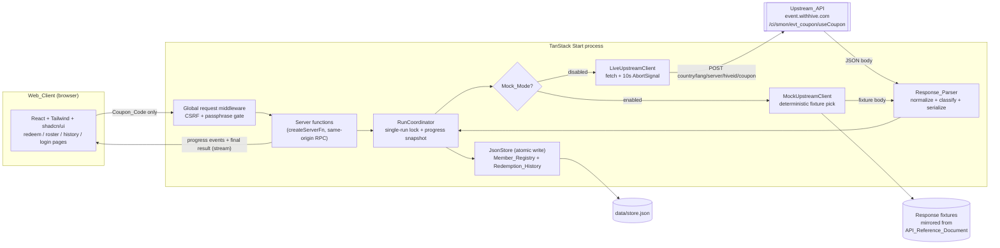
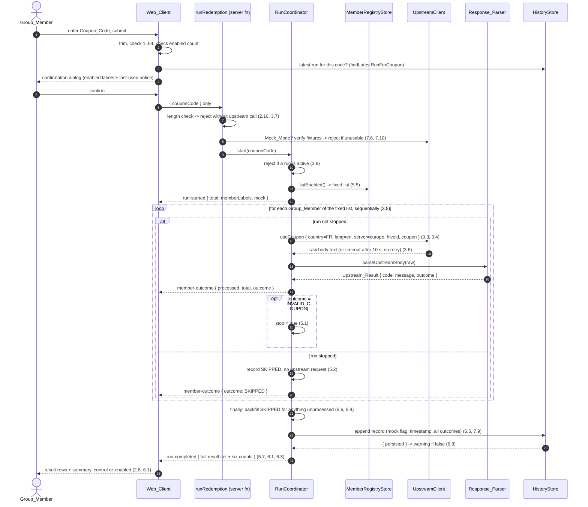

# Design Document

## Overview

The Redemption_App is a small self-hosted TanStack Start application (React + Tailwind CSS + shadcn/ui on the client, TypeScript server layer in the same repository) that redeems one Coupon_Code for every enabled Group_Member of a Member_Registry by calling the Upstream_API `useCoupon` endpoint once per Group_Member.

Three shaping facts drive the whole design:

1. **The browser may never reach the Upstream_API.** `https://event.withhive.com/ci/smon/evt_coupon` does not serve permissive CORS headers, and even if it did, sending every friend's Hive_ID from the browser would expose the roster to any third-party script loaded in the page. All upstream traffic originates from the Redemption_Server. The Web_Client sends only the Coupon_Code (Requirement 3.2).
2. **The run is strictly sequential with one request in flight** (Requirement 3.5) and at most one run exists at a time (Requirement 3.9). That makes the run a single piece of server-side state, not a set of parallel jobs, and it makes the "run in progress" lock a plain in-process guard rather than a distributed lock.
3. **`checkUser` is never called.** The official page performs `checkUser` before `useCoupon`; this application deliberately skips it, so each Group_Member costs exactly one upstream request (Requirement 3.4). `checkUser` is still documented in the API_Reference_Document (Requirement 7.1) because the document describes the upstream contract, not this application's call graph.

The workload is tiny: at most 100 roster entries, at most 100 enabled Group_Members per Redemption_Run, one coupon at a time, a handful of users who are friends of each other. Every technology choice below is deliberately sized for that, and the design flags where that sizing is a tradeoff rather than a fact.

### Research notes informing this design

- **Server functions vs server routes.** TanStack Start exposes two server primitives. `createServerFn()` from `@tanstack/react-start` defines same-origin typed RPC that Start serializes across the client/server boundary; `createFileRoute(...)({ server: { handlers: { GET, POST } } })` defines raw HTTP endpoints intended for callers outside the app. The docs are explicit that server functions are the right tool when only your own app calls them, and that server functions are protected from cross-site calls by `createCsrfMiddleware()` (installed automatically unless the app defines `src/start.ts`). Sources: [Server Functions](https://tanstack.com/start/latest/docs/framework/react/guide/server-functions), [Server Routes](https://tanstack.com/start/latest/docs/framework/react/guide/server-routes). Content was rephrased for compliance with licensing restrictions.
- **Streaming from a server function.** A server function handler may be an `async function*`; the yielded chunks stay typed on the client, consumed with `for await (... of await fn())`. Source: [Streaming Data from Server Functions](https://tanstack.com/start/latest/docs/framework/react/guide/streaming-data-from-server-functions). This is the mechanism used for the progress indicator.
- **shadcn/ui on TanStack Start.** The current documented path scaffolds the project through the shadcn CLI (`pnpm dlx shadcn@latest init -t start`), which produces a TanStack Start project with Tailwind CSS and the `@/*` alias already configured; components are then added with `pnpm dlx shadcn@latest add <component>`. For an existing app the documented path is `pnpm dlx @tanstack/cli@latest create` (choosing TanStack Start + React, without the `shadcn` add-on) followed by `pnpm dlx shadcn@latest init`. Source: [shadcn/ui — TanStack Start](https://ui.shadcn.com/docs/installation/tanstack). Content was rephrased for compliance with licensing restrictions.
- **Global middleware and CSRF.** `src/start.ts` is not part of the default template; creating it and exporting `createStart(() => ({ requestMiddleware: [...] }))` registers middleware that runs for every request, including server functions and SSR. Request middleware is `createMiddleware().server(async ({ next, request }) => ...)`. The docs also state that once a custom `src/start.ts` exists, the CSRF middleware must be added explicitly — `createCsrfMiddleware({ filter: (ctx) => ctx.handlerType === 'serverFn' })` — and that a server function is the endpoint to protect, since a route `beforeLoad` guard is route UX rather than the data boundary. Source: [Middleware](https://tanstack.com/start/latest/docs/framework/react/guide/middleware). Content was rephrased for compliance with licensing restrictions.
- **Property-based testing library.** [fast-check](https://fast-check.dev/) (4.x) is the choice for TypeScript. It needs no runner-specific integration and is documented as working with Vitest directly, so `fc.assert(fc.property(...), { numRuns: 100 })` runs inside an ordinary Vitest `test`. Content was rephrased for compliance with licensing restrictions.

No API beyond those documented primitives is assumed anywhere in this design.

## Architecture

The Redemption_App is one deployable unit: a single TanStack Start process serving the Web_Client bundle and hosting the Redemption_Server. The Redemption_Server owns three collaborators: the `MemberRegistryStore` and `HistoryStore` (both backed by one JSON file), and the `UpstreamClient`, which has a live implementation and a Mock_Mode implementation selected once at startup.



### Why the transport is a streaming server function

Requirement 2.7 needs the Web_Client to display "processed / total" **while** the Redemption_Run advances, and Requirement 3.5 forces the run to be one sequential loop on the server. Two realistic options exist:

| Option | How it works | Cost |
| --- | --- | --- |
| **Streaming server function (chosen)** | `runRedemption` is `createServerFn({ method: 'POST' }).handler(async function* () { ... })`. It yields a `run-started` event, then one `member-outcome` event after each Group_Member is recorded, then a terminal `run-completed` / `run-failed` event carrying the full result set. The client consumes it with `for await`. | The run is bound to the open response. Because a generator advances only while its consumer pulls, a client that navigates away or reloads does not merely lose the event feed — the run ends: the coordinator's `finally` releases the lock and records `SKIPPED` for every Group_Member it had not reached, and no Redemption_History record is appended, because the run did not complete. |
| **Fire-and-forget + polling** | `startRedemption` returns a `runId` immediately; the client polls `getRunProgress({ runId })` every ~500 ms until the run is terminal. | Any client can attach at any time, but the progress indicator lags by up to the poll interval, and the design gains an extra endpoint, a poll loop, and a completed-run retention rule. |

Streaming is chosen because it produces the exact counter Requirement 2.7 asks for with no polling latency, and because the terminal event delivers the complete result set in the same response, which is what Requirements 5.7 and 6.1 consume. **The accepted tradeoff:** progress delivery is tied to one open response.

The tradeoff is contained rather than ignored. The single-run lock demanded by Requirement 3.9 already forces the server to hold the active run in a module-level `RunCoordinator`, so that coordinator also keeps a snapshot of the in-flight run (`runId`, processed count, total, outcomes so far). A second read endpoint, `getActiveRun`, exposes that snapshot. The Web_Client calls it on mount, so a reloaded page or a second browser tab shows a correct progress indicator and a disabled submission control (Requirement 2.9) instead of a stale idle screen. `getActiveRun` is a cheap read of state that has to exist anyway; it is not a second execution path.

Because a Redemption_Run is at most 100 sequential requests of at most 10 seconds each, the worst-case response duration is roughly 17 minutes. That is acceptable for a self-hosted app for a group of friends, but it means any reverse proxy in front of the process needs a response timeout above that, and it rules out serverless platforms with short hard response caps. This is recorded as a deployment constraint, not a code constraint, and it is written down for the operator in `docs/deployment.md` together with the other three: the session cookie is always `Secure`, the failed-attempt throttle trusts `X-Forwarded-For` / `X-Real-IP`, and an absent `APP_PASSPHRASE` leaves the app open.

### Why a JSON file, not SQLite or a server database

The persistence requirements are: survive restarts (Requirements 1.7, 6.5), preserve roster insertion order (Requirement 1.4), retain at least the 100 most recent Redemption_History records (Requirement 6.5), cap the roster at 100 entries (Requirement 1.11), and report a warning when a write fails while still serving the change from memory (Requirement 1.8).

The chosen store is **one JSON document at `data/store.json`, held in memory and written atomically** (write `store.json.tmp`, `fsync`, `rename`). Rationale:

- The entire dataset is bounded by roughly 100 roster entries plus 200 retained history records, each holding at most 100 outcome rows — a few hundred kilobytes at worst. Reading it fully into memory at startup is trivial, and every read requirement (ordering, filtering, counting) becomes a plain array operation.
- Insertion order is the array order. No `ORDER BY`, no sequence column to get wrong.
- Requirement 1.8 becomes natural: the in-memory document is mutated first, the flush is attempted second, and a rejected flush turns into `persisted: false` on the response. With a database driver the in-memory copy and the durable copy would have to be reconciled explicitly.
- A single writer is guaranteed. The process is single-node, and Requirement 3.9 permits only one Redemption_Run at a time, so there is no write concurrency to serialize beyond an in-process promise chain that keeps flushes strictly ordered.

SQLite (via `node:sqlite` or `better-sqlite3`) was considered and rejected: it buys transactional durability, indexing, and concurrent readers, none of which this dataset needs, and it adds a schema, a migration story, and a native or version-gated dependency. If the dataset later grows beyond a friend group, or if multiple processes need to write, the `MemberRegistryStore` / `HistoryStore` interfaces defined below are the seam to swap in — they expose no JSON-specific concepts.

Corruption handling is explicit rather than implicit: if `data/store.json` is absent, the store starts empty; if it is present but unparseable, the process renames it to `store.corrupt-<timestamp>.json`, starts empty, and logs a warning, so a bad file degrades the app to an empty roster instead of preventing startup.

## Project Structure and Scaffolding

The repository is empty, so scaffolding is part of this design.

```
pnpm dlx shadcn@latest init -t start     # TanStack Start + React + Tailwind + shadcn/ui + @/* alias
pnpm dlx shadcn@latest add button input card table badge dialog alert switch sonner
pnpm add -D vitest @vitest/coverage-v8 fast-check @testing-library/react \
            @testing-library/user-event jsdom
pnpm add zod
```

`pnpm` is the package manager, Node 22 LTS the runtime (native `fetch`, `AbortSignal.timeout`, stable `node:test`-independent tooling). If the shadcn CLI template is unavailable, the documented fallback is `pnpm dlx @tanstack/cli@latest create` (TanStack Start, React, recommended defaults, **without** the `shadcn` add-on) followed by `pnpm dlx shadcn@latest init`.

```
.
├─ docs/
│  ├─ upstream-api.md              # API_Reference_Document (Requirement 7.1, 7.2)
│  └─ deployment.md                # the four operator obligations (see Architecture)
├─ data/
│  └─ store.json                   # created at runtime, gitignored
├─ fixtures/
│  └─ upstream/
│     ├─ success-100.json          # byte-identical to the doc examples (Requirement 7.3)
│     ├─ already-used-h304.json
│     └─ invalid-coupon-h306.json
├─ src/
│  ├─ routes/
│  │  ├─ __root.tsx                # shell, nav, Mock_Mode banner, <Toaster />
│  │  ├─ index.tsx                 # redemption page (Requirement 2)
│  │  ├─ roster.tsx                # roster page (Requirement 1)
│  │  ├─ history.tsx               # history page (Requirement 6.6, 6.9)
│  │  ├─ login.tsx                 # passphrase form (Decision A2, Requirement 8.4)
│  │  └─ logout.ts                 # session invalidation (Requirement 8.7)
│  ├─ components/
│  │  ├─ ui/                       # shadcn/ui generated primitives
│  │  ├─ RosterTable.tsx
│  │  ├─ AddMemberForm.tsx
│  │  ├─ CouponForm.tsx
│  │  ├─ ConfirmRunDialog.tsx      # Requirement 2.5, 6.7
│  │  ├─ RunProgress.tsx           # Requirement 2.7
│  │  ├─ RunResultTable.tsx        # Requirement 6.1, 6.2
│  │  ├─ OutcomeSummary.tsx        # Requirement 6.3
│  │  ├─ MockModeBanner.tsx        # Requirement 7.4, 7.8
│  │  ├─ LogoutButton.tsx          # Requirement 8.7
│  │  └─ runState.ts               # the run-state machine reducer (Requirements 2.8, 2.9)
│  ├─ domain/                      # client-safe, no server imports
│  │  ├─ types.ts                  # shared types (below)
│  │  ├─ schemas.ts                # zod schemas for validated inputs
│  │  ├─ outcomes.ts               # MEMBER_OUTCOME_VALUES, counting helpers
│  │  ├─ rosterMessages.ts         # rejection messages shared by form and server
│  │  └─ responseParser.ts         # Response_Parser + serializer (pure)
│  ├─ server/
│  │  ├─ config.server.ts          # Mock_Mode + passphrase env reading
│  │  ├─ auth.server.ts            # session cookie sign/verify, constant-time compare, throttle
│  │  ├─ gate.server.ts            # the Access_Gate decision, as a pure function
│  │  ├─ store/
│  │  │  ├─ jsonStore.server.ts    # load / mutate / atomic flush
│  │  │  ├─ memberRegistry.server.ts
│  │  │  └─ history.server.ts
│  │  ├─ upstream/
│  │  │  ├─ client.ts              # UpstreamClient interface
│  │  │  ├─ live.server.ts         # fetch + 10s timeout
│  │  │  └─ mock.server.ts         # fixture loading + deterministic pick
│  │  └─ run/
│  │     ├─ coordinator.server.ts  # single-run lock, sequential loop, early stop
│  │     └─ redemptionRequest.server.ts  # pre-flight checks, one place for all rejections
│  ├─ functions/                   # createServerFn wrappers only
│  │  ├─ members.functions.ts
│  │  ├─ redemption.functions.ts
│  │  ├─ history.functions.ts
│  │  └─ config.functions.ts
│  └─ start.ts                     # global request middleware: CSRF + passphrase gate
└─ tests/
   ├─ unit/                        # example + edge-case tests
   ├─ property/                    # fast-check properties (one file per property + generators.ts)
   ├─ integration/                 # run loop against a stub UpstreamClient
   ├─ setup/                       # jsdom setup for the .dom test files
   └─ support/                     # the stub UpstreamClient shared by run-loop tests
```

The `.server.ts` / `.functions.ts` / plain-`.ts` split follows the file-organization convention in the TanStack Start server-functions guide: `.server.ts` modules are imported only from inside server function handlers, `.functions.ts` modules hold `createServerFn` wrappers and are safe to import from components, and unsuffixed modules under `src/domain/` are client-safe. `responseParser.ts` lives in `src/domain/` on purpose: it is pure, and keeping it out of `src/server/` lets the property tests import it without pulling in any server-only module.

Environment configuration (`.env`, read only on the server):

| Variable | Values | Meaning |
| --- | --- | --- |
| `MOCK_MODE` | `true` / `false`, case-insensitive | Enables Mock_Mode. Absent, whitespace-only, or unrecognized ⇒ disabled (Requirements 7.5, 7.7) |
| `UPSTREAM_BASE_URL` | URL | Defaults to `https://event.withhive.com/ci/smon/evt_coupon` |
| `DATA_FILE` | path | Defaults to `./data/store.json` |
| `APP_PASSPHRASE` | string | The shared passphrase of Decision A2. Absent ⇒ the gate is off and startup logs an unauthenticated warning |
| `SESSION_SECRET` | string | Key used to sign the session cookie. Absent ⇒ generated per process, so sessions do not survive a restart |

## Components and Interfaces

### Shared domain types (`src/domain/types.ts`)

```ts
/** The six allowed Member_Outcome values, in the order the summary renders them. */
export const MEMBER_OUTCOME_VALUES = [
  'SUCCESS',
  'ALREADY_USED',
  'INVALID_COUPON',
  'SKIPPED',
  'UPSTREAM_ERROR',
  'TRANSPORT_ERROR',
] as const

export type MemberOutcomeValue = (typeof MEMBER_OUTCOME_VALUES)[number]

/** A Member_Registry entry as stored and as returned to the Web_Client. */
export interface MemberRegistryEntry {
  /** Stable surrogate key; the Hive_ID is the uniqueness key but is not used as the id. */
  readonly id: string
  readonly memberLabel: string          // 1..40 chars, whitespace-trimmed
  readonly hiveId: string               // 1..64 chars, whitespace-trimmed, unique
  readonly enabled: boolean
  /** ISO 8601. Persisted for auditing; roster order is array order, not this field. */
  readonly createdAt: string
}

/** Upstream_Result: the typed output of the Response_Parser. */
export interface UpstreamResult {
  /** Normalized response code: <= 100 chars, '' only for TRANSPORT_ERROR. */
  readonly responseCode: string
  /** Response message: <= 500 chars, '' when retMsg was absent/null/non-string. */
  readonly responseMessage: string
  readonly outcome: MemberOutcomeValue
}

/** Member_Outcome: exactly one per enabled Group_Member of a Redemption_Run. */
export type MemberOutcome =
  | {
      readonly hiveId: string
      readonly memberLabel: string
      /** Position in the fixed list of the Redemption_Run, 0-based. */
      readonly position: number
      readonly outcome: Exclude<MemberOutcomeValue, 'SKIPPED'>
      /** Present for every outcome derived from (or in place of) an upstream response. */
      readonly upstreamResult: UpstreamResult
    }
  | {
      readonly hiveId: string
      readonly memberLabel: string
      readonly position: number
      readonly outcome: 'SKIPPED'
      /** No Upstream_API request was issued for this Group_Member. */
      readonly upstreamResult: null
    }

export type OutcomeCounts = Readonly<Record<MemberOutcomeValue, number>>

/** The complete result set of one Redemption_Run. */
export interface RedemptionRunResult {
  readonly runId: string
  readonly couponCode: string
  readonly completedAt: string          // ISO 8601
  readonly mock: boolean
  /** True when an INVALID_COUPON outcome or a server failure ended the run early. */
  readonly stoppedEarly: boolean
  /** One entry per enabled Group_Member of the fixed list, in processing order. */
  readonly outcomes: readonly MemberOutcome[]
  /** All six keys always present, including zero counts. */
  readonly counts: OutcomeCounts
  /** Non-fatal notices, e.g. a failed Redemption_History append. */
  readonly warnings: readonly string[]
}

/** Progress snapshot of the Redemption_Run currently in progress, if any. */
export interface ActiveRunSnapshot {
  readonly runId: string
  readonly couponCode: string
  readonly startedAt: string
  readonly mock: boolean
  readonly total: number                // size of the fixed list
  readonly processed: number             // outcomes recorded so far
  readonly outcomes: readonly MemberOutcome[]
}

/** Events streamed by the redemption server function. */
export type RunEvent =
  | {
      readonly type: 'run-started'
      readonly runId: string
      readonly total: number
      readonly memberLabels: readonly string[]
      readonly mock: boolean
    }
  | {
      readonly type: 'member-outcome'
      readonly runId: string
      readonly processed: number
      readonly total: number
      readonly outcome: MemberOutcome
    }
  | { readonly type: 'run-completed'; readonly runId: string; readonly result: RedemptionRunResult }
  | {
      readonly type: 'run-failed'
      readonly runId: string
      readonly message: string
      /** Still complete: SKIPPED for every Group_Member with no request issued. */
      readonly result: RedemptionRunResult
    }

/** A Redemption_History record. Outcomes are denormalized so deleting a
 *  Member_Registry entry cannot alter or remove history (Requirement 1.5).
 *  Holds no submitter field: see Decision B. */
export interface RedemptionHistoryRecord {
  readonly runId: string
  /** Monotonic append counter; breaks completedAt ties (Requirement 6.6). */
  readonly seq: number
  readonly couponCode: string
  readonly completedAt: string
  readonly mock: boolean
  readonly stoppedEarly: boolean
  readonly outcomes: readonly {
    readonly hiveId: string
    readonly memberLabel: string
    readonly outcome: MemberOutcomeValue
    readonly responseCode: string
    readonly responseMessage: string
  }[]
}
```

### Endpoint result envelope

Every server function returns a discriminated envelope instead of throwing. The requirements repeatedly specify that a rejection returns a *message* the Web_Client displays (Requirements 1.2, 1.3, 1.11, 2.10, 3.7, 3.8, 3.9, 6.4, 7.6, 7.10); an envelope makes those messages part of the type, and keeps thrown errors reserved for genuine bugs.

```ts
export type AppErrorCode =
  | 'VALIDATION'
  | 'DUPLICATE_HIVE_ID'
  | 'ROSTER_FULL'
  | 'MEMBER_NOT_FOUND'
  | 'NO_ENABLED_MEMBERS'
  | 'RUN_IN_PROGRESS'
  | 'FIXTURE_UNAVAILABLE'

export type Envelope<T> =
  | { readonly ok: true; readonly data: T; readonly warnings: readonly string[] }
  | { readonly ok: false; readonly error: { readonly code: AppErrorCode; readonly message: string } }
```

`warnings` is empty on every successful write whose flush succeeded (Requirement 1.12) and carries exactly one persistence warning when the flush failed (Requirement 1.8).

### Server function surface (`src/functions/*.functions.ts`)

All of these are `createServerFn` server functions, not server routes: nothing outside the Web_Client calls them, and TanStack Start's automatic `createCsrfMiddleware()` protection applies to server functions specifically. No server route is defined by this feature.

```ts
// members.functions.ts
export const listMembers: () => Promise<Envelope<MemberRegistryEntry[]>>
// Requirement 1.4 — insertion order.

export const addMember: (opts: { data: { memberLabel: string; hiveId: string } })
  => Promise<Envelope<MemberRegistryEntry>>
// Requirements 1.1, 1.2, 1.3, 1.11, 1.12.

export const setMemberEnabled: (opts: { data: { id: string; enabled: boolean } })
  => Promise<Envelope<MemberRegistryEntry>>
// Requirement 1.9.

export const removeMember: (opts: { data: { id: string } }) => Promise<Envelope<{ id: string }>>
// Requirement 1.5 — history untouched.

// redemption.functions.ts
export const runRedemption: (opts: { data: { couponCode: string } })
  => Promise<AsyncIterable<RunEvent>>
// POST, async generator handler. Requirements 2.7, 3.1, 3.9, 5.7, 6.1.
// A pre-flight rejection (length, no enabled members, run in progress, fixture
// unavailable) is delivered as a single terminal 'run-failed' event with an
// empty outcome list, so the client has one code path for all failures.

export const getActiveRun: () => Promise<Envelope<ActiveRunSnapshot | null>>
// Reconnect/second-tab support for Requirements 2.7 and 2.9.

// history.functions.ts
export const listHistory: (opts?: { data?: { limit?: number } })
  => Promise<Envelope<RedemptionHistoryRecord[]>>
// Requirement 6.6 ordering applied server-side.

export const findLatestRunForCoupon: (opts: { data: { couponCode: string } })
  => Promise<Envelope<RedemptionHistoryRecord | null>>
// Requirement 6.7. A dedicated read rather than a client-side scan of listHistory:
// the character-for-character Coupon_Code comparison stays on the server, and the
// confirmation dialog receives one record or null.

// config.functions.ts
export const getAppConfig: () => Promise<Envelope<{ mockMode: boolean }>>
// Requirements 7.4, 7.8. Read once in the root route loader.
```

`addMember`, `setMemberEnabled`, `removeMember`, and `runRedemption` attach `.validator(...)` so malformed payloads are rejected before the handler runs; the schemas live in `src/domain/schemas.ts` and are reused by the client forms so that client-side and server-side validation messages cannot drift (Requirements 2.3 and 2.10 state the same 1–64 rule on both sides).

The validator is a **plain non-throwing function** that parses with the zod schema and hands the handler a verdict — not `zodValidator` from `@tanstack/zod-adapter`. `zodValidator` throws on a validation failure, which is exactly what the `Envelope` contract above forbids: every rejection the requirements enumerate has to come back as a message on a returned value, so a thrown validation error would turn a specified rejection into an exception the Web_Client cannot render. `@tanstack/zod-adapter` is therefore not a dependency of this application.

### Server-side collaborators

```ts
// src/server/store/memberRegistry.server.ts
export interface MemberRegistryStore {
  list(): MemberRegistryEntry[]                            // insertion order
  listEnabled(): MemberRegistryEntry[]                     // insertion order, enabled only
  add(input: { memberLabel: string; hiveId: string }):
    | { kind: 'added'; entry: MemberRegistryEntry; persisted: boolean }
    | { kind: 'duplicate'; conflictingLabel: string }
    | { kind: 'full' }
  setEnabled(id: string, enabled: boolean):
    | { kind: 'updated'; entry: MemberRegistryEntry; persisted: boolean }
    | { kind: 'not-found' }
  remove(id: string): { kind: 'removed'; persisted: boolean } | { kind: 'not-found' }
}

// src/server/store/history.server.ts
export interface HistoryStore {
  append(record: Omit<RedemptionHistoryRecord, 'seq'>): { persisted: boolean }
  list(limit?: number): RedemptionHistoryRecord[]           // Requirement 6.6 order
  findLatestByCouponCode(couponCode: string): RedemptionHistoryRecord | null  // Requirement 6.7
}

// src/server/upstream/client.ts
export interface UseCouponRequest {
  readonly hiveid: string
  readonly coupon: string
}
export interface UpstreamRawResponse {
  /** Raw body text, or null when no body was received (timeout, network error). */
  readonly bodyText: string | null
  readonly status: number | null
  /** Set when the request never produced a usable response. */
  readonly transportFailure: 'timeout' | 'network' | null
}
export interface UpstreamClient {
  readonly isMock: boolean
  useCoupon(req: UseCouponRequest): Promise<UpstreamRawResponse>
}

// src/server/run/coordinator.server.ts
export interface RunCoordinator {
  /** Rejects with RUN_IN_PROGRESS while a Redemption_Run is active (Requirement 3.9). */
  start(couponCode: string): AsyncGenerator<RunEvent, void, void>
  snapshot(): ActiveRunSnapshot | null
}
```

The `UpstreamClient` boundary is where Mock_Mode is decided, and it is decided exactly once at startup (Requirement 7.5). `LiveUpstreamClient` never reads a fixture (Requirement 7.11) and `MockUpstreamClient` never calls `fetch` (Requirement 7.3). Because the interface returns raw body text rather than a parsed object, the Response_Parser sees byte-identical input in both modes, which is what makes Mock_Mode a faithful stand-in.

`LiveUpstreamClient.useCoupon` posts to `${UPSTREAM_BASE_URL}/useCoupon` with `country=FR`, `lang=en`, `server=europe`, `hiveid`, `coupon` (Requirement 3.3), using `AbortSignal.timeout(10_000)`; an abort maps to `transportFailure: 'timeout'` and is never retried (Requirement 3.6).

### Web_Client composition

| Route | Components | Requirements |
| --- | --- | --- |
| `/` | `MockModeBanner`, `CouponForm`, `ConfirmRunDialog`, `RunProgress`, `RunResultTable`, `OutcomeSummary` | 2.1–2.9, 6.1–6.4, 6.7, 7.4, 7.8 |
| `/roster` | `AddMemberForm`, `RosterTable` | 1.1–1.5, 1.9–1.12 |
| `/history` | history table | 6.6, 6.9 |
| `/login` | passphrase form | Decision A2 (no requirement yet) |

The redemption page holds one `useReducer` run-state machine — `idle → confirming → running → completed | failed` — fed by the `RunEvent` stream. The submission control is disabled for the whole `running` state, so Requirement 2.9 is enforced by the state machine rather than by an ad-hoc boolean, and the same state is seeded from `getActiveRun` on mount.

### How the data pages read and re-read (Requirement 1.4)

Every read is a **route `loader` calling a server function**, and every re-read is `router.invalidate()`. One mechanism, used identically by `/`, `/roster`, and `/history`: the loader is the only read of a document, and each of the three roster mutations (`addMember`, `setMemberEnabled`, `removeMember`) awaits `router.invalidate()` **after** its envelope came back `ok`, which re-runs the loader, so the table always shows stored state. A rejected mutation returns before that call, so nothing is re-read on a failed write.

TanStack Query is deliberately **not** used, and this is a correction to an earlier draft of this design that assumed it ships with the TanStack Start toolchain. It does not: `@tanstack/react-query` is not a dependency of this repository (`@tanstack/react-router-ssr-query` is, but it only integrates the two and declares react-query as a peer), and no `QueryClient` is created or provided anywhere. Adopting it would mean adding the dependency, mounting a provider in the shell, and calling `setupRouterSsrQueryIntegration` in `src/router.tsx`; without that last step a `useQuery` renders an empty first paint and refetches after hydration, which is strictly worse than a loader that already has the data at first paint. Loaders satisfy the invalidation behaviour the requirements ask for — the roster is re-read after every successful mutation — with no added dependency, so they are the design. If a client cache is ever wanted (optimistic writes, cross-page sharing, background refetch), the swap is local: each page's loader becomes a query over the same server function, and no presentational component changes, because all of them take their data as props.

## Data Models

The in-memory and wire shapes are the TypeScript types declared under Components and Interfaces above: `MemberRegistryEntry` (Member_Registry), `UpstreamResult`, `MemberOutcome`, `RedemptionRunResult`, `ActiveRunSnapshot`, `RunEvent`, and `RedemptionHistoryRecord` (Redemption_History). This section defines how they are persisted.

### Persistence schema

One JSON document, versioned so a future shape change can migrate rather than guess:

```jsonc
{
  "version": 1,
  "nextHistorySeq": 42,
  "members": [
    {
      "id": "01J8Z0X5QK",
      "memberLabel": "Alice",
      "hiveId": "1234567890",
      "enabled": true,
      "createdAt": "2025-01-04T18:21:03.123Z"
    }
  ],
  "history": [
    {
      "runId": "01J8Z12ABC",
      "seq": 41,
      "couponCode": "SW2025NEWYEAR",
      "completedAt": "2025-01-04T18:24:55.900Z",
      "mock": false,
      "stoppedEarly": false,
      "outcomes": [
        {
          "hiveId": "1234567890",
          "memberLabel": "Alice",
          "outcome": "SUCCESS",
          "responseCode": "100",
          "responseMessage": "The coupon gift has been sent."
        }
      ]
    }
  ]
}
```

Invariants the store enforces on every mutation:

- `members` is append-ordered; `list()` returns it as-is, which is the roster order of Requirement 1.4 and the processing order of Requirement 5.5.
- `hiveId` is unique across `members` under exact character comparison after trimming (Requirement 1.2).
- `members.length <= 100`; an add beyond that is rejected without mutation (Requirement 1.11).
- `history` is append-ordered and trimmed to the newest **200** records after each append. The requirement is "at least 100" (Requirement 6.5); 200 gives headroom while keeping the file small, and the trim drops from the front so the newest records always survive.
- `nextHistorySeq` increases monotonically and never resets, so the tie-break in Requirement 6.6 stays correct across restarts.
- History outcome rows carry a snapshot of `memberLabel` and `hiveId`. Deleting a roster entry therefore cannot alter, renumber, or remove a history record (Requirement 1.5).

History ordering is a stable sort by `completedAt` descending, then `seq` descending (Requirement 6.6). `findLatestByCouponCode` compares `couponCode` character-for-character and returns the first match in that same order (Requirement 6.7).

Writes are serialized through a single promise chain inside `jsonStore.server.ts`: mutate the in-memory document synchronously, enqueue a flush, and resolve the caller with `persisted: true | false` once the flush settles. A rejected flush leaves the in-memory document mutated on purpose — Requirement 1.8 requires the change to remain visible with a warning attached.

## Response_Parser: Normalization, Classification, Serialization

The Response_Parser is a pure function over the raw body text. It has one entry point plus a serializer, both in `src/domain/responseParser.ts`.

```ts
export function parseUpstreamBody(input: {
  bodyText: string | null
  transportFailure?: 'timeout' | 'network' | null
}): UpstreamResult

export function serializeUpstreamResult(result: UpstreamResult): string
```

### Normalization (Requirement 4.9)

`normalizeRetCode(raw: number | string): string`

1. **String input** — remove leading and trailing whitespace; preserve the case of what remains.
2. **Number input** — render as a decimal digit string with no grouping separators and no trailing fractional zeros:
   - non-finite (`NaN`, `±Infinity`) is treated as "not a number or string" and falls to Requirement 4.6;
   - integral and within safe-integer range: `BigInt(value).toString()` — this avoids the exponential form `String(1e21)` would produce;
   - otherwise: take `String(value)`, and if it contains a fractional part, strip trailing `0` characters and a trailing `.`.
3. Keep only the first 100 characters of the result.

`normalizeRetMsg(raw: unknown): string` returns `''` when the value is absent, `null`, or not a string (Requirement 4.10); otherwise the string truncated to its first 500 characters (Requirement 4.1).

Note that the message is **not** trimmed and **not** unescaped. `"Invalid coupon code.<br/>Please check again."` is kept exactly as received, including the `<br/>` characters. That is a deliberate pairing with Requirement 6.2, which demands literal rendering.

### Classification (Requirements 4.2–4.6)

```
parseUpstreamBody(input):
  if input.transportFailure is set                    -> TRANSPORT_ERROR, code '', message names the failure
  if bodyText is null                                 -> TRANSPORT_ERROR, code '', message 'response body absent'
  if byteLength(bodyText) > 65536                      -> TRANSPORT_ERROR, code '', message 'response body exceeds 64 kilobytes'
  parsed = tryJsonParse(bodyText)
  if parse failed                                     -> TRANSPORT_ERROR, code '', message 'response body is not valid JSON'
  if parsed is not an object or lacks 'retCode'        -> TRANSPORT_ERROR, code '', message 'retCode field absent'
  if typeof retCode is neither number nor string       -> TRANSPORT_ERROR, code '', message 'retCode field is neither a number nor a string'
  code = normalizeRetCode(retCode)
  message = normalizeRetMsg(parsed.retMsg)
  switch code:
    '100'    -> SUCCESS
    '(H304)' -> ALREADY_USED
    '(H306)' -> INVALID_COUPON
    ''       -> TRANSPORT_ERROR                        (design decision, see below)
    default  -> UPSTREAM_ERROR
```

Comparison is exact and case-sensitive (Requirement 4.5). Every TRANSPORT_ERROR message is capped at 500 characters and names which of the enumerated conditions occurred (Requirement 4.6).

**Design decision filling a specification gap:** Requirement 4.5 classifies a code with *at least one character* that matches none of the three known codes as `UPSTREAM_ERROR`, and Requirements 4.2–4.4 cover the three known codes. A `retCode` that is present but normalizes to the empty string (for example `{"retCode":"   "}`) is therefore unclassified by the letter of the requirements. This design classifies it as `TRANSPORT_ERROR` with an empty response code, matching the treatment of a missing `retCode`, and it keeps the round-trip property total: an `UpstreamResult` with an empty code survives serialize-then-parse unchanged. This should be reflected back into the requirements when they are next revised.

### Serialization and the round trip (Requirements 4.7, 4.8)

```ts
serializeUpstreamResult({ responseCode, responseMessage }) =>
  JSON.stringify({ retCode: responseCode, retMsg: responseMessage })
```

`retCode` is always emitted as a JSON string, `retMsg` as the message with no characters added or removed (Requirement 4.7).

The round trip in Requirement 4.8 holds because normalization is idempotent on its own output:

- a `responseCode` produced by normalization is already trimmed and already at most 100 characters, so re-normalizing it as a string is the identity;
- a `responseMessage` produced by normalization is already at most 500 characters, so re-truncating is the identity;
- classification is a pure function of the normalized code, so an identical code yields an identical Member_Outcome.

The one shape that does not survive naively is the number form: the first parse converts `100` to `"100"`, and the serializer emits `"retCode":"100"`. The property is stated on the `UpstreamResult`, not on the body text, so this is exactly the intended behaviour — `parse(serialize(parse(body)))` equals `parse(body)` field for field, even though `serialize(parse(body))` is not byte-identical to `body`. This is called out here because it is the likeliest place for an implementer to write the wrong assertion.

### Mock_Mode fixture selection (Requirement 7.3)

`MockUpstreamClient` reads the three fixture files from `fixtures/upstream/` **at request time** (with a per-process cache keyed by file path) rather than importing them as modules, so that an absent or corrupt fixture is a reachable runtime condition and Requirement 7.6 has a real failure path. A missing or unparseable fixture aborts the request before any Member_Outcome is derived and before any Redemption_History append (Requirements 7.6, 7.10).

Selection is a pure function of the pair, so two Redemption_Runs with identical input produce identical Member_Outcomes:

```
key    = `${couponCode}\u0000${hiveId}`
h      = fnv1a32(utf8Bytes(key))
bucket = h % 16
bucket 0..9   -> success-100.json
bucket 10..14 -> already-used-h304.json
bucket 15     -> invalid-coupon-h306.json
```

FNV-1a is chosen because it is a few lines of dependency-free code and fully specified, so the mapping is reproducible across machines and Node versions. The 16-bucket weighting keeps `INVALID_COUPON` rare: it triggers the early stop of Requirement 5, so a uniform 1-in-3 split would truncate most mock runs after the first Group_Member and make the mock useless for exercising the full loop. A single-fixture override for deliberate testing is available through the test seam (an injected `UpstreamClient`), not through configuration, to keep the runtime behaviour deterministic.

## The Redemption_Run Loop



```
runRedemption(couponCode):
  trimmed = trim(couponCode)
  if len(trimmed) < 1 or len(trimmed) > 64        -> run-failed VALIDATION, no upstream request, no history (2.10, 3.7)
  if mockMode and fixtures unusable               -> run-failed FIXTURE_UNAVAILABLE, no upstream request, no history (7.6, 7.10)
  if coordinator has an active run                -> run-failed RUN_IN_PROGRESS, active run untouched (3.9)
  acquire lock
  fixedList = registry.listEnabled()              -- snapshot, fixed for the whole run (5.5)
  if fixedList is empty                           -> release lock, run-failed NO_ENABLED_MEMBERS (2.4, 3.8)
  yield run-started { runId, total: fixedList.length, memberLabels, mock }
  outcomes = []
  stopped  = false
  try:
    for (index, member) of fixedList:
      if stopped:
        outcomes.push(SKIPPED for member)          -- no request issued (5.1, 5.2)
        yield member-outcome
        continue
      raw    = upstream.useCoupon({ hiveid: member.hiveId, coupon: trimmed })   -- exactly one request (3.4)
      result = parseUpstreamBody(raw)
      outcomes.push({ ...member, position: index, outcome: result.outcome, upstreamResult: result })
      yield member-outcome { processed: outcomes.length, total }
      if result.outcome == 'INVALID_COUPON': stopped = true                     -- (5.1, 5.3)
  finally:
    for every member of fixedList without an outcome: outcomes.push(SKIPPED)    -- (5.8)
    release lock
  runResult = { runId, couponCode: trimmed, completedAt: now(), mock, stoppedEarly: stopped,
                outcomes, counts: countOutcomes(outcomes), warnings }
  { persisted } = history.append(runResult)                                      -- (6.5, 7.9)
  if not persisted: runResult.warnings.push('The Redemption_History record is not persisted.')  -- (6.8)
  yield run-completed { result: runResult }
```

Three structural points:

- The lock is acquired **before** the fixed list is snapshotted and released in a `finally`, so a thrown error cannot leave the coordinator permanently locked.
- The `finally` block backfills `SKIPPED` for anything unprocessed. That single mechanism satisfies both the early-stop skip of Requirement 5.2 and the server-failure case of Requirement 5.8, and it is what makes the outcome-count invariant of Requirement 5.6 hold on every path — including a run that never issues a request.
- `ALREADY_USED`, `UPSTREAM_ERROR`, and `TRANSPORT_ERROR` fall through without retry, so the loop continues with the next Group_Member (Requirement 5.4). No code path issues a second request for the same Group_Member in the same run.

Because the terminal event is yielded immediately after the loop and the history append, the complete result set reaches the Web_Client well inside the 1-second bound of Requirement 5.7 — the only work between deriving `INVALID_COUPON` and yielding is building at most 99 `SKIPPED` records and one file write.

## Correctness Properties

A property is a characteristic or behavior that should hold true across all valid executions of a system — essentially, a formal statement about what the system should do. Properties serve as the bridge between human-readable specifications and machine-verifiable correctness guarantees.

This feature suits property-based testing because its core is pure and input-shaped: the Response_Parser is a total function from arbitrary bytes to a typed value, the Redemption_Run loop is a deterministic fold over a roster given a stubbed `UpstreamClient`, and the stores are in-memory data structures with order and uniqueness invariants. The React rendering and the deployment wiring are covered by example-based tests instead.

The list below is the consolidated output of the acceptance-criteria prework analysis. Criteria that describe one concrete state, one injected failure, one timing bound, or the content of a document are deliberately absent here and are routed to example, integration, or smoke tests in the Testing Strategy instead.

Properties 1 to 4 cover the Response_Parser.

### Property 1: Response parsing is total and bounded

*For any* input body text — arbitrary Unicode strings, valid and invalid JSON, empty, and oversized — together with any transport-failure flag, `parseUpstreamBody` returns exactly one Upstream_Result whose response code holds at most 100 characters, whose response message holds at most 500 characters, and whose Member_Outcome is one of the six allowed values, without throwing.

**Validates: Requirements 4.1, 4.10**

### Property 2: The normalized code determines the Member_Outcome

*For any* JSON body whose `retCode` is a number or a string, the normalized response code follows the normalization rule — a number rendered as a decimal digit string without grouping separators and without trailing fractional zeros, a string trimmed with its letter case preserved, truncated to 100 characters — and the derived Member_Outcome equals `SUCCESS` when that code is exactly `100`, `ALREADY_USED` when it is exactly `(H304)`, `INVALID_COUPON` when it is exactly `(H306)`, `UPSTREAM_ERROR` when it holds at least one character and matches none of those three under case-sensitive comparison, and `TRANSPORT_ERROR` when it holds no character; and the Upstream_Result retains that code together with the normalized response message, which is empty whenever `retMsg` was absent, null, or not a string.

**Validates: Requirements 4.2, 4.3, 4.4, 4.5, 4.9, 4.10**

### Property 3: Malformed responses classify as TRANSPORT_ERROR with a naming message

*For any* input that is an absent body, a body larger than 64 kilobytes, a string that is not valid JSON, a JSON object without a `retCode` field, or a JSON object whose `retCode` is neither a number nor a string, the Upstream_Result holds the Member_Outcome `TRANSPORT_ERROR`, an empty response code, and a message of at most 500 characters that names which of those five conditions occurred.

**Validates: Requirements 4.6**

### Property 4: Parse / serialize / parse round trip

*For any* Upstream_API response body — including every body documented in the API_Reference_Document — parsing, then serializing, then parsing again yields an Upstream_Result whose response code, response message, and Member_Outcome each equal those of the first parse, and the serialized body holds the response message with no character added or removed.

**Validates: Requirements 4.7, 4.8**

Properties 5 to 11 cover the Redemption_Run engine and the proxy contract.

### Property 5: Every enabled Group_Member gets exactly one Member_Outcome

*For any* Member_Registry, any Coupon_Code of 1 to 64 characters, and any sequence of stubbed upstream responses — including a sequence that triggers an early stop and a stub that throws before the first request — the completed Redemption_Run reports exactly one Member_Outcome per entry of the fixed list of enabled Group_Members, each carrying that Group_Member's Member_Label and its response message, reports no Member_Outcome for any Group_Member absent from that list, and yields six outcome counts whose sum equals the size of that fixed list.

**Validates: Requirements 3.1, 5.6, 5.8, 6.3**

### Property 6: An invalid coupon stops the run and skips exactly the remainder

*For any* Member_Registry with at least one enabled Group_Member and any stubbed response sequence in which some position yields `INVALID_COUPON`, the Redemption_Run issues no Upstream_API request after that position, reports `INVALID_COUPON` at that position, reports `SKIPPED` for exactly the Group_Members positioned after it in the list fixed at run start, and leaves the Member_Outcomes of the Group_Members before it unchanged — even when the Member_Registry is mutated while the run is in progress.

**Validates: Requirements 5.1, 5.2, 5.3, 5.5**

### Property 7: Non-fatal outcomes never stop the run and never retry

*For any* Member_Registry and any stubbed response sequence containing no `INVALID_COUPON`, the Redemption_Run issues exactly one Upstream_API request per enabled Group_Member, every request addressed to `useCoupon` and none to `checkUser`, in Member_Registry order, with at most one request in flight at any moment, and reports no `SKIPPED` outcome.

**Validates: Requirements 3.4, 3.5, 5.4**

### Property 8: Every upstream request carries the Fixed_Request_Fields

*For any* Coupon_Code of 1 to 64 characters and any enabled Group_Member, the request the Redemption_Server issues holds `country` equal to `FR`, `lang` equal to `en`, `server` equal to `europe`, `hiveid` equal to that Group_Member's Hive_ID, and `coupon` equal to the submitted Coupon_Code.

**Validates: Requirements 3.3**

### Property 9: At most one Redemption_Run ever executes

*For any* number of redemption requests issued concurrently while a Redemption_Run is in progress, exactly one Redemption_Run executes, every other request is rejected with a message stating that a Redemption_Run is in progress, no Upstream_API request is issued for a rejected request, and the outcomes of the executing Redemption_Run are identical to those of the same run performed without the rejected requests.

**Validates: Requirements 3.9**

### Property 10: The server rejects out-of-range Coupon_Codes without side effects

*For any* submitted Coupon_Code that holds zero characters before trimming, zero characters after trimming, or more than 64 characters, the Redemption_Server rejects the request with a message stating the permitted length of 1 to 64 characters, issues zero Upstream_API requests, and appends zero Redemption_History records.

**Validates: Requirements 2.10, 3.7**

### Property 11: The redemption payload carries the Coupon_Code alone

*For any* Member_Registry and any submitted Coupon_Code, the payload the Web_Client sends to the Redemption_Server holds the Coupon_Code as its only value and contains no Hive_ID of any Member_Registry entry.

**Validates: Requirements 3.2**

Properties 12 to 17 cover the Member_Registry and the Redemption_History.

### Property 12: Roster mutation preserves order, uniqueness, and the cap

*For any* sequence of add, enable/disable, and remove operations applied to a Member_Registry, the roster the Redemption_Server serves holds its entries ordered from the earliest stored to the most recently stored, holds no two entries with the same Hive_ID, holds at most 100 entries, reflects for each surviving entry the last enabled state submitted for it, and accompanies every successful mutation whose store write succeeded with zero persistence warning messages.

**Validates: Requirements 1.1, 1.4, 1.9, 1.11, 1.12**

### Property 13: Roster validation rejects invalid submissions without mutating

*For any* submitted Member_Label and Hive_ID pair in which either value holds zero characters after trimming, or the Member_Label exceeds 40 characters, or the Hive_ID exceeds 64 characters, or the trimmed Hive_ID is character-for-character identical to an existing entry's Hive_ID, the submission is rejected with a message naming the rejected field and its allowed range or naming the conflicting Member_Label, and the Member_Registry is unchanged.

**Validates: Requirements 1.2, 1.3**

### Property 14: Persistence round trip

*For any* sequence of roster mutations and Redemption_Run appends, reloading the store from its written file yields a Member_Registry holding the same entries in the same order with the same Member_Labels, Hive_IDs, and enabled states, and a Redemption_History holding at least the 100 most recent records with their Coupon_Code, completion timestamp, and Member_Outcomes unchanged.

**Validates: Requirements 1.7, 6.5**

### Property 15: Deleting a roster entry preserves history and excludes the entry

*For any* Member_Registry and any Redemption_History, removing a roster entry leaves every Redemption_History record that references the removed Hive_ID present with its Member_Outcome, response code, and response message unchanged, and omits that entry from every later roster response; and for any Member_Registry, every disabled entry is absent from the fixed list of every later Redemption_Run and from the enabled count reported for it.

**Validates: Requirements 1.5, 1.6**

### Property 16: History ordering is total and stable

*For any* set of Redemption_History records, the history view orders them from the most recent completion timestamp to the oldest, and orders records sharing a completion timestamp from the most recently appended to the least recently appended.

**Validates: Requirements 6.6**

### Property 17: A previously used Coupon_Code is announced with its latest timestamp

*For any* Redemption_History and any submitted Coupon_Code, the confirmation dialog states the completion timestamp of the most recent Redemption_History record whose Coupon_Code is character-for-character identical to the submitted Coupon_Code, and states no such timestamp when no record matches under that exact comparison.

**Validates: Requirements 6.7**

Properties 18 to 20 cover the Web_Client.

### Property 18: Coupon submission trims, preserves case, and blocks invalid lengths

*For any* entered value, the Web_Client submits exactly the value with leading and trailing whitespace removed and the letter case of the remainder preserved; and *for any* entered value holding fewer than 1 or more than 64 characters after that removal, the Web_Client displays a message stating the permitted length of 1 to 64 characters, keeps the entered value in the input field, and sends no request to the Redemption_Server.

**Validates: Requirements 2.2, 2.3**

### Property 19: The confirmation dialog lists exactly the enabled Group_Members

*For any* Member_Registry holding at least one enabled entry, the confirmation dialog lists the Member_Label of every enabled Group_Member in Member_Registry order and lists no disabled Group_Member.

**Validates: Requirements 2.5**

### Property 20: Result rendering is literal and complete

*For any* completed Redemption_Run result, the result view renders one row per Member_Outcome of the fixed list in processing order, including every `SKIPPED` row, each holding the Member_Label and the Member_Outcome; renders the response message of every `UPSTREAM_ERROR` and `TRANSPORT_ERROR` row as text that holds no HTML tag and from which no element is created, truncated to its first 500 characters after tag removal; and renders a summary holding all six outcome counts including counts equal to zero.

Note on the second clause, which was revised. It originally required every markup character to be *visible as a character*, so `<br/>` was shown to the reader as six characters. Both readings satisfy Requirement 6.2's real obligation — upstream text must never be interpreted as markup — but the original put upstream noise in front of the reader, and the Upstream_API does send HTML: `Invalid coupon code.<br/>Please check again.` and `Invalid Hive ID.<br/>Please check again.` are documented bodies. Tags are therefore removed before display by `stripUpstreamMarkup` in `src/domain/upstreamMessage.ts`, with `<br>` becoming a newline so the break the upstream intended survives.

The injection defence does not rest on that choice and is unchanged: a tag is *deleted, never interpreted*, the result is still passed as a React text child, `dangerouslySetInnerHTML` remains banned by the `react/no-danger` ESLint rule, and `tests/unit/serverFunctionSurface.test.ts` fails if it ever appears in `src/`. Stored values are untouched, so the Response_Parser round trip of Requirement 4.8 and the Redemption_History records are unaffected. HTML entities are deliberately not decoded, since decoding `&lt;br/&gt;` would manufacture the very tag being removed.

**Validates: Requirements 6.1, 6.2, 6.3**

Properties 21 to 23 cover Mock_Mode.

### Property 21: Mock_Mode is deterministic, documented, and offline

*For any* pair of Coupon_Code and Hive_ID, repeated Mock_Mode redemptions select the same response fixture, every fixture body is character-identical to a response body example of the API_Reference_Document, no request is issued to the Upstream_API, and the Redemption_History record appended for the Redemption_Run is marked as derived from mock data.

**Validates: Requirements 7.3, 7.9**

### Property 22: Live mode reads no fixture

*For any* Redemption_Run performed while Mock_Mode is disabled, every reported Member_Outcome is derived from an Upstream_API response and zero response fixtures are read.

**Validates: Requirements 7.11**

### Property 23: Mock_Mode environment parsing

*For any* value of the Mock_Mode environment variable, including absent and whitespace-only values, Mock_Mode is enabled exactly when the trimmed value equals `true` ignoring letter case and is disabled for every other value, and startup completes in every case.

**Validates: Requirements 7.5, 7.7**

The Access_Gate is covered by the property below.

### Property 24: Without a valid Session nothing is read and nothing is run

*For any* request that carries no valid Session while a Shared_Passphrase is configured, the Access_Gate rejects it, the response holds no Member_Registry value and no Redemption_History value, no Redemption_Run starts, and the response holds no character of the Shared_Passphrase; and *for any* submitted value, a Session is granted exactly when that value is character-for-character identical to the Shared_Passphrase and the sender is not throttled.

**Validates: Requirements 8.2, 8.3, 8.4, 8.10**

## Error Handling

| Condition | Where handled | Behaviour |
| --- | --- | --- |
| Coupon_Code out of 1–64 range | Client, then server | Client shows a validation message, keeps the value, sends nothing (Requirement 2.3). Server independently rejects with the same message, issues no upstream request, appends no history (Requirements 2.10, 3.7) |
| No enabled Group_Member | Client, then server | Client shows "add a Group_Member first" and withholds the request (Requirement 2.4); server rejects with `NO_ENABLED_MEMBERS` (Requirement 3.8) |
| Redemption_Run already in progress | Client, then server | Client's state machine keeps the control disabled and the progress indicator visible (Requirement 2.9); server rejects with `RUN_IN_PROGRESS` and leaves the active run untouched (Requirement 3.9) |
| Upstream request exceeds 10 s | `LiveUpstreamClient` | `AbortSignal.timeout(10_000)` aborts, mapped to `TRANSPORT_ERROR`, never retried; the run continues (Requirements 3.6, 5.4) |
| Upstream network failure / non-JSON / oversized body | Response_Parser | `TRANSPORT_ERROR` with a message naming the condition (Requirement 4.6) |
| Unknown `retCode` | Response_Parser | `UPSTREAM_ERROR`, code and message retained for display (Requirements 4.5, 6.2) |
| Member_Registry flush failure | `jsonStore` | Change stays in memory, response carries one persistence warning (Requirement 1.8); a successful flush carries none (Requirement 1.12) |
| Redemption_History append failure | Run loop | Outcomes still returned, plus a warning that the record is not persisted (Requirement 6.8) |
| Missing / corrupt Mock_Mode fixture | `MockUpstreamClient` | Request rejected with `FIXTURE_UNAVAILABLE` naming the fixture and stating absent vs invalid JSON; no upstream request, no outcome, no history (Requirements 7.6, 7.10) |
| Unrecognized `MOCK_MODE` value | `config.server.ts` | Mock_Mode disabled, warning logged naming the variable and the rejected value, startup completes (Requirement 7.7) |
| Corrupt `data/store.json` at startup | `jsonStore` | File renamed aside, store starts empty, warning logged; the app boots |
| Unexpected server exception mid-run | Run loop `finally` | Remaining Group_Members recorded as `SKIPPED`, lock released, `run-failed` carries the complete result set (Requirement 5.8) |
| Request without a valid Session | `passphraseMiddleware` | Rejected before any store read or run start; response directs the sender to the login route and discloses no roster or history value (Requirements 8.2, 8.3) |
| Incorrect passphrase submission | `auth.server.ts` | Generic "passphrase is incorrect" message, no Session granted, attempt counted toward the per-IP throttle (Requirements 8.5, 8.8) |
| `APP_PASSPHRASE` absent | `config.server.ts` | Startup completes, warning logged that the app is reachable without a passphrase, gate off (Requirement 8.9) |
| Any server error response | Web_Client | Error notification holding the returned message, Coupon_Code retained, control re-enabled (Requirement 6.4) |

Upstream messages are never interpreted as markup anywhere. Requirement 6.2 demands literal text, and `retMsg` demonstrably contains HTML fragments (`Invalid coupon code.<br/>Please check again.`). Every message is rendered as a React text child — `{message.slice(0, 500)}` — and `dangerouslySetInnerHTML` is banned in this codebase, enforced by an ESLint rule (`react/no-danger`) rather than by convention. React escapes text children by default, so `<br/>` appears as the five visible characters it is, which is both the literal-rendering requirement and the injection defence: a hostile or unexpected upstream message cannot inject markup into the page.

## Decisions Settled in This Design

Two questions are not answered by the requirements, and both change what gets built rather than only how it gets built. Both are decided here rather than left open. Each records the alternatives considered so the reasoning can be re-examined later.

### Decision A: access control — a single shared passphrase gate

**Decision: the app ships a shared passphrase gate (option A2 below), and the deployment guidance to keep it off the public internet stands regardless.**

**The problem.** The Member_Registry holds every friend's Hive_ID in plaintext, and anyone who can reach the redemption endpoint can spend any coupon on behalf of every enabled Group_Member. Coupons are single-use per account, so that action is destructive and irreversible: a stranger who submits a valid code consumes the group's rewards permanently. Requirement set 1 through 7 contains no authentication criterion, so the app as specified would be open to every client that can reach the port. The Redemption_History additionally discloses which coupons were redeemed for whom and when.

**Alternatives considered.**

| Option | What it costs | What it buys |
| --- | --- | --- |
| **A1 — No application auth, containment only** | Nothing to build. A startup warning, a README deployment note, and the discipline to bind to `127.0.0.1` and reach it through a VPN or an authenticating reverse proxy. | Zero scope growth. Security depends entirely on the operator getting the deployment right, with no in-app safety net if the port is ever exposed. |
| **A2 — Single shared passphrase gate (chosen)** | An `APP_PASSPHRASE` env var, a login route, a session-cookie middleware registered in `src/start.ts`, a constant-time comparison, and per-IP throttling of failed attempts. Roughly one implementation task plus tests. | A stranger who reaches the port can neither read the roster nor spend a coupon. |
| **A3 — Per-member accounts** | User records, credential storage, reset flows, session management. A feature of its own size. | Individual attribution and revocation. |

**Why A2 is proportionate.** The group is a set of friends who already trust each other with their Hive_IDs — they are handing them over to be typed into a shared roster. What they need protection from is not each other, it is the internet: a stranger scanning the port, a link shared one hop too far, a home router with an accidental port forward. A single shared secret defends against exactly that, and it is the smallest change that removes "the deployment is the only defence." A3 buys attribution nobody asked for and would double the size of this spec to get it. A1 leaves an irreversible, destructive action reachable by anyone who finds the port, which is not a defensible default even for a hobby deployment.

**How it is built.** `src/start.ts` already exists in this design for the CSRF middleware, so the gate attaches there with no restructuring:

```ts
// src/start.ts
import { createStart, createCsrfMiddleware, createMiddleware } from '@tanstack/react-start'

const csrfMiddleware = createCsrfMiddleware({
  filter: (ctx) => ctx.handlerType === 'serverFn',
})

/** Rejects any request without a valid session cookie, except the login route. */
const passphraseMiddleware = createMiddleware().server(async ({ next, request }) => {
  /* verify signed session cookie, else 401 */
  return next()
})

export const startInstance = createStart(() => ({
  requestMiddleware: [csrfMiddleware, passphraseMiddleware],
}))
```

Specifics the implementation must not soften:

- The gate is a **request middleware registered globally**, so it covers every server function and the login route alike. A per-route `beforeLoad` guard is route UX, not the data boundary, and the TanStack Start docs say so explicitly.
- The session cookie is signed, `HttpOnly`, `SameSite=Strict`, and `Secure`, obtainable only by posting the correct passphrase to the login route.
- The comparison is constant-time (`crypto.timingSafeEqual` over equal-length digests), and failed attempts are throttled per client IP.
- `APP_PASSPHRASE` absent means the gate is **off** and the server logs a prominent startup warning that it is running unauthenticated. Refusing to start would be worse: it would push operators toward a weak throwaway value or a patched startup path.

**Requirements backing.** This behaviour is covered by Requirement 8, which was added to the requirements after this decision was taken: reading the Shared_Passphrase at startup, the unauthenticated-startup warning when it is absent, rejecting every request without a valid Session before any store read, the login and logout flows, constant-time comparison, the failed-attempt throttle, and keeping the passphrase out of responses and logs. Nothing else in this design depends on the choice. If it is ever revisited, falling back to A1 means dropping Requirement 8 and the middleware, and promoting the startup warning and the deployment note to explicit deliverables — no other section is affected.

### Decision B: Redemption_History does not record who submitted the code

**Decision: no submitter field (option B1 below).**

**The problem.** Requirement 6.5 enumerates what a Redemption_History record holds — the Coupon_Code, the completion timestamp, and one Member_Outcome per enabled Group_Member — and does not include the submitter. The history therefore answers "which codes were redeemed for whom" but not "who ran it."

**Alternatives considered.**

| Option | What it costs | What it buys |
| --- | --- | --- |
| **B1 — No submitter field (chosen)** | Nothing. Matches Requirement 6.5 as written. | Every field in the record is verifiable. |
| **B2 — Self-declared submitter** | A `submittedBy` field holding a denormalized `{ hiveId, memberLabel }` snapshot, a selector on the redemption page, a clause added to Requirement 6.5, and a rule for what the field holds when the selector is left blank. | A rough note of who triggered each run. |
| **B3 — Authenticated submitter** | Only meaningful under A3, since a shared passphrase identifies the group, not a person. | A trustworthy audit trail. |

**Why B1.** Under the chosen A2 there is no verified identity, so a `submittedBy` field would be a free-text label anyone could set to anyone's name. That looks like accountability without providing it, which is worse than an absent field — it invites people to trust a value the system cannot stand behind. The practical need in a friend group is "has this code already been run," not "who ran it," and the confirmation-dialog notice of Requirement 6.7 already answers that. The group coordinates out of band anyway.

**If this is revisited.** B2 is a contained change: one optional field on `RedemptionHistoryRecord`, one selector component, one clause on Requirement 6.5. The `version` field in the persisted document makes the addition a migration rather than a break, and `HistoryStore.append` needs no structural change. A self-declared submitter is personal data attached to every run, so it should be treated as such if the app is ever shared beyond the group.

## Security Considerations

**Threat model.** The app is worth attacking even though it is small:

- The Member_Registry holds every friend's Hive_ID in plaintext, so any read of `listMembers` discloses the whole roster.
- Anyone who can call the redemption endpoint can spend any coupon on behalf of every enabled Group_Member. Coupons are single-use per account, so this is a destructive, irreversible action.
- The Redemption_History discloses which coupons were redeemed for whom and when.
- `retMsg` is third-party text, outside our control, that lands in the DOM.

Each is answered below.

1. **Authentication: the shared passphrase gate of Decision A2, specified by Requirement 8.** Global request middleware in `src/start.ts` requires a signed, `HttpOnly`, `SameSite=Strict`, `Secure` session cookie, obtainable only by posting `APP_PASSPHRASE` to the login route, compared in constant time, with failed attempts throttled per IP. The gate covers server functions because they are independently reachable endpoints; route-level guards are not the data boundary. With `APP_PASSPHRASE` unset the app runs open and says so loudly at startup (Requirement 8.9).
2. **Deployment containment, regardless of the gate.** Bind the process to `127.0.0.1` or a private network and reach it through a VPN or an authenticating reverse proxy. Do not expose it to the public internet. The gate is a safety net for a mistake here, not a licence to skip it. Three properties of the gate depend on the deployment and are stated as operator obligations in `docs/deployment.md`: the session cookie is issued `Secure`, so a Session cannot be held over plain `http://`; the per-IP throttle of Requirement 8.8 identifies senders by `X-Forwarded-For` / `X-Real-IP`, so it is only trustworthy behind a proxy that sets those headers and strips client-supplied copies; and an absent `APP_PASSPHRASE` disables the gate entirely.
3. **No markup from upstream ever reaches the DOM as markup.** Every message renders as a React text child (`{message.slice(0, 500)}`), and `dangerouslySetInnerHTML` is banned, enforced by the `react/no-danger` ESLint rule. React escapes text children, so `<br/>` shows as the five visible characters it is — the literal-rendering requirement (6.2) and the injection defence are the same mechanism. Property 20 asserts it over generated hostile messages.
4. **No Hive_ID in any redemption payload** (Requirement 3.2, Property 11). Hive_IDs cross to the browser only in the roster view.
5. **No cross-origin browser traffic.** The browser talks only to same-origin server functions. Because this design defines `src/start.ts`, `createCsrfMiddleware({ filter: (ctx) => ctx.handlerType === 'serverFn' })` is registered there explicitly — with a custom `start.ts` the automatic installation no longer applies, and omitting it would silently drop the protection.
6. **No secrets in the client bundle.** `UPSTREAM_BASE_URL`, `MOCK_MODE`, `DATA_FILE`, and `APP_PASSPHRASE` are read only in `.server.ts` modules, which the build keeps out of the browser bundle.
7. **Input length caps everywhere.** Coupon_Code ≤ 64, Member_Label ≤ 40, Hive_ID ≤ 64, response body ≤ 64 KiB, response code ≤ 100, response message ≤ 500. These bound both storage and the amount of upstream-controlled text that reaches the DOM.
8. **Upstream traffic is inherently rate-bounded** by the sequential loop and the single-run lock: at most one in-flight request per process, so the app cannot be turned into an amplifier against the Upstream_API.
9. **`data/store.json` is gitignored** and created with `0600` permissions, since it is a plaintext list of account identifiers.

## Testing Strategy

Tooling: **Vitest** as the runner (native TypeScript and Vite config reuse, so the app's aliases work unchanged), **fast-check** for property-based tests, **@testing-library/react** with **jsdom** for component behaviour, and a hand-written stub implementation of `UpstreamClient` for run-loop tests. No HTTP interception library is needed because the `UpstreamClient` interface is the injection point; `msw` stays out of the dependency list unless a future test needs to exercise `LiveUpstreamClient`'s own `fetch` call, which is covered instead by a small number of tests against a local `http` server.

**Property tests** (`tests/property/`) implement the 24 properties above, exactly one property-based test per property, each configured with `fc.assert(..., { numRuns: 100 })` at minimum, and each tagged with a comment in the required form:

```ts
// Feature: shared-coupon-redemption, Property 4: For any Upstream_API response body —
// including every body documented in the API_Reference_Document — parsing, then
// serializing, then parsing again yields an Upstream_Result whose response code,
// response message, and Member_Outcome each equal those of the first parse.
```

Two properties deserve explicit mention because they are the load-bearing ones:

- **Property 4 (round trip, Requirement 4.8)** is asserted over a generator that unions arbitrary bodies with the three API_Reference_Document fixtures read from `fixtures/upstream/`, so the documented bodies are always among the cases tried. The assertion compares the three `UpstreamResult` fields of the first and second parse, not the body text.
- **Property 5 (outcome-count invariant, Requirement 5.6)** generates a roster of 0–100 entries with arbitrary enabled flags plus an arbitrary stubbed response sequence — including sequences that yield `INVALID_COUPON` at any position and a stub that throws mid-run — and asserts that `outcomes.length` equals the fixed-list length, that the outcome `hiveId` multiset equals the fixed-list `hiveId` multiset with no duplicates, and that the six counts sum to that same length.

Generators live in `tests/property/generators.ts`: arbitrary Member_Labels and Hive_IDs including whitespace-padded, empty, boundary-length (1, 40, 41, 64, 65) and non-ASCII values; arbitrary response bodies including empty strings, non-JSON, JSON non-objects, oversized bodies, numeric and string `retCode`, missing and non-string `retMsg`, and case variants of the three known codes. The edge cases identified in the prework analysis are covered by these generators rather than by separate tests.

**Unit and integration tests** (`tests/unit/`, `tests/integration/`) stay deliberately few, covering what properties cannot:

- the empty-roster message and the empty-history message (Requirements 1.10, 6.9);
- the redemption page structure: one coupon input capped at 64 characters and one submission control (Requirement 2.1);
- the empty-enabled-roster guard on both sides: the client's "add a Group_Member first" message with no request sent, and the server's rejection with no upstream request (Requirements 2.4, 3.8);
- one timed test asserting an early-stopped run with a 100-entry roster returns its complete result set as a success within 1 second of the `INVALID_COUPON` response (Requirement 5.7);
- the confirmation dialog listing enabled Member_Labels in roster order, the dismissal path, and the previously-used-coupon notice (Requirements 2.5, 2.6, 6.7);
- the progress indicator advancing as `RunEvent`s arrive and the submission control being disabled throughout and re-enabled after (Requirements 2.7, 2.8, 6.4);
- the Mock_Mode indicator appearing on the redemption page and in the result view when enabled and being absent when disabled (Requirements 7.4, 7.8);
- the two persistence-warning paths, driven by a store whose flush is forced to reject (Requirements 1.8, 6.8);
- the fixture-unavailable paths, driven by deleting and by corrupting a fixture file (Requirements 7.6, 7.10);
- one integration test asserting that `LiveUpstreamClient` posts the five fields and abandons a deliberately slow local server after 10 seconds (Requirements 3.3, 3.6);
- one smoke test asserting `docs/upstream-api.md` names both endpoint URLs, all five request field names, and for each field whether it is fixed or supplied per Redemption_Run (Requirement 7.1);
- the passphrase gate: a server function call without a session is rejected and leaks no roster or history value, the correct passphrase issues a session that admits later calls, logout invalidates it, a wrong passphrase returns a generic message and counts toward the per-IP throttle, the throttle blocks even a correct passphrase while active, and an absent `APP_PASSPHRASE` logs the unauthenticated-startup warning while leaving the app usable (Requirements 8.1–8.5, 8.7–8.10);
- one test asserting each fixture file is byte-identical to the corresponding fenced example in `docs/upstream-api.md` and that the outcome the document states for each example matches what `parseUpstreamBody` derives, so the API_Reference_Document and the mock data cannot drift (Requirements 7.2, 7.3).

Not covered by automated tests, and stated as such: visual styling, the actual behaviour of the live Upstream_API (never contacted from CI), and the deployment-level access control described under Security Considerations.

## Requirements Traceability

| Requirement | Design element |
| --- | --- |
| 1.1, 1.3 | `addMember` + `schemas.ts` validation; `MemberRegistryStore.add`; Properties 12, 13 |
| 1.2 | `add` duplicate branch returning `conflictingLabel`; store uniqueness invariant; Property 13 |
| 1.4 | `members` array order; `MemberRegistryStore.list`; `RosterTable`; Property 12 |
| 1.5 | `removeMember`; denormalized `RedemptionHistoryRecord.outcomes`; Property 15 |
| 1.6 | `MemberRegistryStore.listEnabled` used for the fixed list and the reported total; Property 15 |
| 1.7 | `jsonStore` load at startup; store version field; Property 14 |
| 1.8, 1.12 | `persisted` flag on every mutation result; `Envelope.warnings`; Property 12 (1.12) |
| 1.9 | `setMemberEnabled`; Property 12 |
| 1.10 | `RosterTable` empty state |
| 1.11 | 100-entry cap in `MemberRegistryStore.add`; Property 12 |
| 2.1 | `CouponForm` input with `maxLength` 64 and one submit control |
| 2.2, 2.3 | `CouponForm` + shared zod schema; Property 18 |
| 2.4 | `CouponForm` guard on the roster query |
| 2.5, 2.6 | `ConfirmRunDialog`; Property 19 (2.5) |
| 2.7 | Streamed `run-started` / `member-outcome` events; `RunProgress`; `getActiveRun` on mount |
| 2.8 | Run state machine `completed` transition |
| 2.9 | Run state machine `running` state; server-side `RUN_IN_PROGRESS` |
| 2.10 | Server-side length check in `runRedemption` before any upstream call; Property 10 |
| 3.1 | `runRedemption` signature; `MemberOutcome` carrying label, outcome, and message; Property 5 |
| 3.2 | `runRedemption` payload is `{ couponCode }` only; Property 11 |
| 3.3 | `LiveUpstreamClient.useCoupon` field construction; Property 8 |
| 3.4 | One `useCoupon` call per loop iteration; no `checkUser` client method exists |
| 3.5 | Sequential `for` loop with `await`; Property 7 |
| 3.6 | `AbortSignal.timeout(10_000)`; `transportFailure: 'timeout'` |
| 3.7, 3.8, 3.9 | Pre-flight checks in `runRedemption`; `RunCoordinator` lock; Properties 10 (3.7), 9 (3.9) |
| 4.1, 4.9, 4.10 | `parseUpstreamBody`, `normalizeRetCode`, `normalizeRetMsg`; Properties 1, 2 |
| 4.2–4.5 | Classification switch; Property 2 |
| 4.6 | Malformed-input branches with naming messages; Property 3 |
| 4.7, 4.8 | `serializeUpstreamResult`; Property 4 |
| 5.1–5.3, 5.5 | `stopped` flag and fixed-list snapshot in the run loop; Property 6 |
| 5.4 | Fall-through for non-`INVALID_COUPON` outcomes; Property 7 |
| 5.6, 5.8 | `finally` backfill of `SKIPPED`; `countOutcomes`; Property 5 |
| 5.7 | Terminal event yielded immediately after the loop |
| 6.1, 6.2 | `RunResultTable` with literal text rendering and 500-char cap; Property 20 |
| 6.3 | `OutcomeSummary` over `MEMBER_OUTCOME_VALUES`; `RedemptionRunResult.counts`; Properties 5, 20 |
| 6.4 | `run-failed` handling in the run state machine |
| 6.5 | `HistoryStore.append` with 200-record retention; Property 14 |
| 6.6 | `HistoryStore.list` sort by `completedAt` desc then `seq` desc; Property 16 |
| 6.7 | `HistoryStore.findLatestByCouponCode`, read by the `findLatestRunForCoupon` server function and rendered by `ConfirmRunDialog`; Property 17 |
| 6.8 | `warnings` appended when the history flush fails |
| 6.9 | History page empty state |
| 7.1, 7.2 | `docs/upstream-api.md` |
| 7.3 | `MockUpstreamClient` FNV-1a fixture selection; fixture/doc byte-identity test; Property 21 |
| 7.4, 7.8 | `getAppConfig` + `MockModeBanner` on redemption page and result view |
| 7.5, 7.7 | `config.server.ts` `MOCK_MODE` parsing; Property 23 |
| 7.6, 7.10 | Request-time fixture load; `FIXTURE_UNAVAILABLE` rejection before any outcome or history append |
| 7.9 | `RedemptionHistoryRecord.mock` flag; Property 21 |
| 7.11 | `LiveUpstreamClient` reads no fixture; client chosen once at startup; Property 22 |
| 8.1, 8.9 | `config.server.ts` reads `APP_PASSPHRASE`; unauthenticated-startup warning |
| 8.2, 8.3 | `passphraseMiddleware` registered globally in `src/start.ts`; rejection before any store read and before `RunCoordinator.start`; Property 24 |
| 8.4, 8.7 | `auth.server.ts` signed session cookie issue and invalidation; `/login` route; Property 24 (8.4) |
| 8.5, 8.6 | `crypto.timingSafeEqual` over equal-length digests; generic failure message |
| 8.8 | Per-IP failed-attempt throttle in `auth.server.ts` |
| 8.10 | `APP_PASSPHRASE` read only in `.server.ts` modules; never serialized into a response, a log line, or the client bundle; Property 24 |
| *No requirement* — Decision B1 | `RedemptionHistoryRecord` deliberately holds no submitter field |
